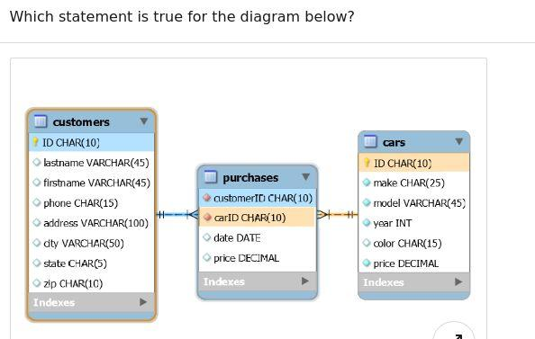
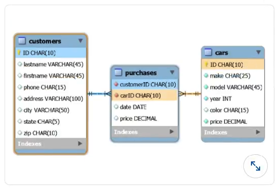

## The Quiz is divided in three parts:

1. **Python**
   - Best Practice (12 Questions)
   - Data types (16 Questions)
   - Coding Skills (35 Questions)
2. **MySQL** (18 questions)
3. **R** (5 questions)


_Answers are available here:_  https://github.com/explorai/ML-Prerequisites-Quiz/blob/gh-pages/answerKeys.md _(Total of 86 questions).  You are responsible to assess your level (Recommended: 70% or better)_

***

## Python (Programming Language)

### Best Practice

#### Q1. A doctest allows for the quality assessment of a code through a simple command (python3 <_filename_>). What is the correct way to write a doctest?

- [ ] 

```python
def sum(a, b):
    # a = 1
    # b = 2
    # sum(a, b) = 3

    return a + b
```

- [ ] 

```python
def sum(a, b):
"
      a = 1     
      b = 2     
      sum(a, b) = 3     
"

      return a + b
```

- [ ] 

```python
def sum(a, b):
'''
      >>> a = 1     
      >>> b = 2     
      >>> sum(a, b)     
      3     
'''

    return a + b
```

- [ ] 

```python
def sum(a, b):
    '''
    a = 1
    b = 2
    sum(a, b) = 3
    '''
    return a + b
```

#### Q2. Which statement does NOT describe the object-oriented programming concept of encapsulation?

- [ ] It protects the data from outside interference.
- [ ] A parent class is encapsulated and no data from the parent class passes on to the child class.
- [ ] It keeps data and the methods that can manipulate that data in one place.
- [ ] It only allows the data to be changed by methods.

#### Q3. What is the purpose of an if/else statement?

- [ ] It tells the computer which chunk of code to run if the instructions you coded are incorrect.
- [ ] It runs one chunk of code if all the imports were successful, and another chunk of code if the imports were not successful.
- [ ] It executes one chunk of code if a condition is true, but a different chunk of code if the condition is false.
- [ ] It tells the computer which chunk of code to run if the is enough memory to handle it, and which chunk of code to run if there is not enough memory to handle it.

#### Q4. What is the term used to describe items that may be passed into a function?

- [ ] arguments
- [ ] paradigms
- [ ] attributes
- [ ] decorators


#### Q5. When does a for loop stop iterating?

- [ ] when it encounters an infinite loop
- [ ] when it encounters an if/else statement that contains a break keyword
- [ ] when it has assessed each item in the iterable it is working on or a break keyword is encountered
- [ ] when the runtime for the loop exceeds O(n^2)

#### Q6. What is the definition of abstraction as applied to object-oriented Python?

- [ ] Abstraction means that a different style of code can be used, since many details are already known to the program behind the scenes.
- [ ] Abstraction means the implementation is hidden from the user, and only the relevant data or information is shown.
- [ ] Abstraction means that the data and the functionality of a class are combined into one entity.
- [ ] Abstraction means that a class can inherit from more than one parent class.

#### Q7. What is the proper way to define a function?

- [ ] `def getMaxNum(list_of_nums): # body of function goes here`
- [ ] `func get_max_num(list_of_nums): # body of function goes here`
- [ ] `func getMaxNum(list_of_nums): # body of function goes here`
- [ ] `def get_max_num(list_of_nums): # body of function goes here`

#### Q8. According to the PEP 8 coding style guidelines, how should constant values be named in Python?

- [ ] in camel case without using underscores to separate words -- e.g. `maxValue = 255`
- [ ] in lowercase with underscores to separate words -- e.g. `max_value = 255`
- [ ] in all caps with underscores separating words -- e.g. `MAX_VALUE = 255`
- [ ] in mixed case without using underscores to separate words -- e.g. `MaxValue = 255`

#### Q9. What is a base case in a recursive function?

- [ ] A base case is the condition that allows the algorithm to stop recursing. It is usually a problem that is small enough to solve directly.
- [ ] The base case is summary of the overall problem that needs to be solved.
- [ ] The base case is passed in as an argument to a function whose body makes use of recursion.
- [ ] The base case is similar to a base class, in that it can be inherited by another object.

#### Q10. Why is it considered good practice to open a file from within a Python script by using the `with` keyword?

- [ ] The `with` keyword lets you choose which application to open the file in.
- [ ] The `with` keyword acts like a `for` loop, and lets you access each line in the file one by one.
- [ ] There is no benefit to using the `with` keyword for opening a file in Python.
- [ ] When you open a file using the `with` keyword in Python, Python will make sure the file gets closed, even if an exception or error is thrown.

#### Q11. Why would you use a virtual environment?

- [ ] Virtual environments create a "bubble" around your project so that any libraries or packages you install within it don't affect your entire machine.
- [ ] Teams with remote employees use virtual environments so they can share code, do code reviews, and collaborate remotely.
- [ ] Virtual environments were common in Python 2 because they augmented missing features in the language. Virtual environments are not necessary in Python 3 due to advancements in the language.
- [ ] Virtual environments are tied to your GitHub or Bitbucket account, allowing you to access any of your repos virtually from any machine.

#### Q12. What will happen if you use a while loop and forget to include logic that eventually causes the while loop to stop?

- [ ] Nothing will happen; your computer knows when to stop running the code in the while loop.
- [ ] You will get a KeyError.
- [ ] Your code will get stuck in an infinite loop.
- [ ] You will get a WhileLoopError.


### Data Types

#### Q1. What is the correct syntax for creating a variable that is bound to a dictionary?

- [ ] `fruit_info = {'fruit': 'apple', 'count': 2, 'price': 3.5}`
- [ ] `fruit_info =('fruit': 'apple', 'count': 2,'price': 3.5 ).dict()`
- [ ] `fruit_info = ['fruit': 'apple', 'count': 2,'price': 3.5 ].dict()`
- [ ] `fruit_info = to_dict('fruit': 'apple', 'count': 2, 'price': 3.5)`

#### Q2. What does it mean for a function to have linear runtime?

- [ ] You did not use very many advanced computer programming concepts in your code.
- [ ] The difficulty level your code is written at is not that high.
- [ ] It will take your program less than half a second to run.
- [ ] The amount of time it takes the function to complete grows linearly as the input size increases.


#### Q3. Describe the functionality of a deque.

- [ ] A deque adds items to one side and remove items from the other side.
- [ ] A deque adds items to either or both sides, but only removes items from the top.
- [ ] A deque adds items at either or both ends, and remove items at either or both ends.
- [ ] A deque adds items only to the top, but remove from either or both sides.

#### Q4. What is the correct syntax for creating a variable that is bound to a set?

- [ ] `myset = {0, 'apple', 3.5}`
- [ ] `myset = to_set(0, 'apple', 3.5)`
- [ ] `myset = (0, 'apple', 3.5).to_set()`
- [ ] `myset = (0, 'apple', 3.5).set()`


#### Q5. What data structure does a binary tree degenerate to if it isn't balanced properly?

- [ ] linked list
- [ ] queue
- [ ] set
- [ ] OrderedDict

#### Q6. What is an abstract class?

- [ ] An abstract class is the name for any class from which you can instantiate an object.
- [ ] Abstract classes must be redefined any time an object is instantiated from them.
- [ ] Abstract classes must inherit from concrete classes.
- [ ] An abstract class exists only so that other "concrete" classes can inherit from the abstract class.


#### Q7. What built-in list method would you use to remove items from a list?

- [ ] `.delete()` method
- [ ] `pop(my_list)`
- [ ] `del(my_list)`
- [ ] `.pop()` method

#### Q8. How does `defaultdict` work?

- [ ] `defaultdict` will automatically create a dictionary for you that has keys which are the integers 0-10.
- [ ] `defaultdict` forces a dictionary to only accept keys that are of the types specified when you created the `defaultdict` (such as string or integers).
- [ ] If you try to access a key in a dictionary that doesn't exist, `defaultdict` will create a new key for you instead of throwing a `KeyError`.
- [ ] `defaultdict` stores a copy of a dictionary in memory that you can default to if the original gets unintentionally modified.

#### Q9. What is the runtime of accessing a value in a dictionary by using its key?

- [ ] O(n), also called linear time.
- [ ] O(log n), also called logarithmic time.
- [ ] O(n^2), also called quadratic time.
- [ ] O(1), also called constant time.

#### Q10. Which collection type is used to associate values with unique keys?

- [ ] `slot`
- [ ] `dictionary`
- [ ] `queue`
- [ ] `sorted list`


#### Q11. Assuming the node is in a singly linked list, what is the runtime complexity of searching for a specific node within a singly linked list?

- [ ] The runtime is O(n) because in the worst case, the node you are searching for is the last node, and every node in the linked list must be visited.
- [ ] The runtime is O(nk), with n representing the number of nodes and k representing the amount of time it takes to access each node in memory.
- [ ] The runtime cannot be determined unless you know how many nodes are in the singly linked list.
- [ ] The runtime is O(1) because you can index directly to a node in a singly linked list.

#### Q12. What is runtime complexity of the list's built-in `.append()` method?

- [ ] O(1), also called constant time
- [ ] O(log n), also called logarithmic time
- [ ] O(n^2), also called quadratic time
- [ ] O(n), also called linear time

#### Q13. What is key difference between a `set` and a `list`?

- [ ] A set is an ordered collection unique items. A list is an unordered collection of non-unique items.
- [ ] Elements can be retrieved from a list but they cannot be retrieved from a set.
- [ ] A set is an ordered collection of non-unique items. A list is an unordered collection of unique items.
- [ ] A set is an unordered collection unique items. A list is an ordered collection of non-unique items.

#### Q14. What is the runtime complexity of searching for an item in a binary search tree?

- [ ] The runtime for searching in a binary search tree is O(1) because each node acts as a key, similar to a dictionary.
- [ ] The runtime for searching in a binary search tree is O(n!) because every node must be compared to every other node.
- [ ] The runtime for searching in a binary search tree is generally O(h), where h is the height of the tree.
- [ ] The runtime for searching in a binary search tree is O(n) because every node in the tree must be visited.

#### Q15. What is the primary difference between lists and tuples?

- [ ] You can access a specifc element in a list by indexing to its position, but you cannot access a specific element in a tuple unless you iterate through the tuple
- [ ] Lists are mutable, meaning you can change the data that is inside them at any time. Tuples are immutable, meaning you cannot change the data that is inside them once you have created the tuple.
- [ ] Lists are immutable, meaning you cannot change the data that is inside them once you have created the list. Tuples are mutable, meaning you can change the data that is inside them at any time.
- [ ] Lists can hold several data types inside them at once, but tuples can only hold the same data type if multiple elements are present.

#### Q16. Describe the functionality of a queue?

- [ ] A queue adds items to either end and removes items from either end.
- [ ] A queue adds items to the top and removes items from the top.
- [ ] A queue adds items to the top, and removes items from anywhere in, a list.
- [ ] A queue adds items to the top and removes items from anywhere in the queue.


### Coding Skills

#### 1. What happens when you use the build-in function `any()` on a list?

- [ ] The `any()` function will randomly return any item from the list.
- [ ] The `any()` function returns True if any item in the list evaluates to True. Otherwise, it returns False.
- [ ] The `any()` function takes as arguments the list to check inside, and the item to check for. If "any" of the items in the list match the item to check for, the function returns True.
- [ ] The `any()` function returns a Boolean value that answers the question "Are there any items in this list?"


#### 2. What statement about static methods is true?

- [ ] Static methods are called static because they always return `None`.
- [ ] Static methods can be bound to either a class or an instance of a class.
- [ ] Static methods serve mostly as utility methods or helper methods, since they can't access or modify a class's state.
- [ ] Static methods can access and modify the state of a class or an instance of a class.


#### 3. What are attributes?

- [ ] Attributes are long-form version of an `if/else` statement, used when testing for equality between objects.
- [ ] Attributes are a way to hold data or describe a state for a class or an instance of a class.
- [ ] Attributes are strings that describe characteristics of a class.
- [ ] Function arguments are called "attributes" in the context of class methods and instance methods.


#### 4. What is the term to describe this code?

`count, fruit, price = (2, 'apple', 3.5)`

- [ ] `tuple assignment`
- [ ] `tuple unpacking`
- [ ] `tuple matching`
- [ ] `tuple duplication`


#### 5. What is one of the most common use of Python's sys library?

- [ ] to capture command-line arguments given at a file's runtime
- [ ] to connect various systems, such as connecting a web front end, an API service, a database, and a mobile app
- [ ] to take a snapshot of all the packages and libraries in your virtual environment
- [ ] to scan the health of your Python ecosystem while inside a virtual environment


#### 6. What is the correct syntax for defining a class called Game, if it inherits from a parent class called LogicGame?

- [ ] `class Game(LogicGame): pass`
- [ ] `def Game(LogicGame): pass`
- [ ] `def Game.LogicGame(): pass`
- [ ] `class Game.LogicGame(): pass`

#### 7. What would this expression return?

```python
college_years = ['Freshman', 'Sophomore', 'Junior', 'Senior']
return list(enumerate(college_years, 2019))
```

- [ ] `[('Freshman', 2019), ('Sophomore', 2020), ('Junior', 2021), ('Senior', 2022)]`
- [ ] `[(2019, 2020, 2021, 2022), ('Freshman', 'Sophomore', 'Junior', 'Senior')]`
- [ ] `[('Freshman', 'Sophomore', 'Junior', 'Senior'), (2019, 2020, 2021, 2022)]`
- [ ] `[(2019, 'Freshman'), (2020, 'Sophomore'), (2021, 'Junior'), (2022, 'Senior')]`

#### 8. What is the correct syntax for defining a class called "Game", if it inherits from a parent class called "LogicGame"?

- [ ] `class Game.LogicGame(): pass`
- [ ] `def Game(LogicGame): pass`
- [ ] `class Game(LogicGame): pass`
- [ ] `def Game.LogicGame(): pass`

#### 9. What is the purpose of the "self" keyword when defining or calling instance methods?

- [ ] `self` means that no other arguments are required to be passed into the method.
- [ ] There is no real purpose for the `self` method; it's just historic computer science jargon that Python keeps to stay consistent with other programming languages.
- [ ] `self` refers to the instance whose method was called.
- [ ] `self` refers to the class that was inherited from to create the object using `self`.

#### 10. What is an instance method?

- [ ] Instance methods can modify the state of an instance or the state of its parent class.
- [ ] Instance methods hold data related to the instance.
- [ ] An instance method is any class method that doesn't take any arguments.
- [ ] An instance method is a regular function that belongs to a class, but it must return `None`.


#### 11. Which choice is the most syntactically correct example of the conditional branching?

- [ ] 

```python
num_people = 5

if num_people > 10:
    print("There is a lot of people in the pool.")
elif num_people > 4;
    print("There are some people in the pool.")
elif num_people > 0;
    print("There are a few people in the pool.")
else:
    print("There is no one in the pool.")
```

- [ ] 

```python
num_people = 5

if num_people > 10:
    print("There is a lot of people in the pool.")
if num_people > 4:
    print("There are some people in the pool.")
if num_people > 0:
    print("There are a few people in the pool.")
else:
    print("There is no one in the pool.")
```

- [ ] 

```python
num_people = 5

if num_people > 10:
    print("There is a lot of people in the pool.")
elif num_people > 4:
    print("There are some people in the pool.")
elif num_people > 0:
    print("There are a few people in the pool.")
else:
    print("There is no one in the pool.")
```

- [ ] 

```python
num_people = 5

if num_people > 10;
    print("There is a lot of people in the pool.")
if num_people > 4:
    print("There are some people in the pool.")
if num_people > 0:
    print("There are a few people in the pool.")
else:
    print("There is no one in the pool.")
```


#### 12. What is the correct syntax for instantiating a new object of the type Game?

- [ ] `my_game = class.Game()`
- [ ] `my_game = class(Game)`
- [ ] `my_game = Game()`
- [ ] `my_game = Game.create()`

#### 13. What does the built-in `map()` function do?

- [ ] It creates a path from multiple values in an iterable to a single value.
- [ ] It applies a function to each item in an iterable and returns the value of that function.
- [ ] It converts a complex value type into simpler value types.
- [ ] It creates a mapping between two different elements of different iterables.

#### 14. If you don't explicitly return a value from a function, what happens?

- [ ] The function will return a RuntimeError if you don't return a value.
- [ ] If the return keyword is absent, the function will return `None`.
- [ ] If the return keyword is absent, the function will return `True`.
- [ ] The function will enter an infinite loop because it won't know when to stop executing its code.


#### 15. What is the purpose of the `pass` statement in Python?

- [ ] It is used to skip the `yield` statement of a generator and return a value of None.
- [ ] It is a null operation used mainly as a placeholder in functions, classes, etc.
- [ ] It is used to pass control from one statement block to another.
- [ ] It is used to skip the rest of a `while` or `for loop` and return to the start of the loop.


#### 16. Given the following three list, how would you create a new list that matches the desired output printed below?

```python
fruits = ['Apples', 'Oranges', 'Bananas']
quantities = [5, 3, 4]
prices = [1.50, 2.25, 0.89]

#Desired output
[('Apples', 5, 1.50),
('Oranges', 3, 2.25),
('Bananas', 4, 0.89)]
```

- [ ] 

```python
output = []

fruit_tuple_0 = (first[0], quantities[0], price[0])
output.append(fruit_tuple)

fruit_tuple_1 = (first[1], quantities[1], price[1])
output.append(fruit_tuple)

fruit_tuple_2 = (first[2], quantities[2], price[2])
output.append(fruit_tuple)

return output
```

- [ ] 

```python
i = 0
output = []
for fruit in fruits:
    temp_qty = quantities[i]
    temp_price = prices[i]
    output.append((fruit, temp_qty, temp_price))
    i += 1
return output
```

- [ ] 

```python
groceries = zip(fruits, quantities, prices)
return groceries

>>> [
('Apples', 5, 1.50),
('Oranges', 3, 2.25),
('Bananas', 4, 0.89)
]
```

- [ ] 

```python
i = 0
output = []
for fruit in fruits:
    for qty in quantities:
        for price in prices:
            output.append((fruit, qty, price))
    i += 1
return output
```

#### 17. What happens when you use the built-in function all() on a list?

- [ ] The `all()` function returns a Boolean value that answers the question "Are all the items in this list the same?
- [ ] The `all()` function returns True if all the items in the list can be converted to strings. Otherwise, it returns False.
- [ ] The `all()` function will return all the values in the list.
- [ ] The `all()` function returns True if all items in the list evaluate to True. Otherwise, it returns False.

#### 18. What is the correct syntax for calling an instance method on a class named Game?

_(Answer format may vary. Game and roll (or dice_roll) should each be called with no parameters.)_

- [ ]

```python
>>> dice = Game()
>>> dice.roll()
```

- [ ]

```python
>>> dice = Game(self)
>>> dice.roll(self)
```

- [ ]

```python
>>> dice = Game()
>>> dice.roll(self)
```

- [ ]

```python
>>> dice = Game(self)
>>> dice.roll()
```


#### 19. What does this function print?

```python
def print_alpha_nums(abc_list, num_list):
    for char in abc_list:
        for num in num_list:
            print(char, num)
    return

print_alpha_nums(['a', 'b', 'c'], [1, 2, 3])
```

- [ ]

```python
a 1
a 2
a 3
b 1
b 2
b 3
c 1
c 2
c 3
```

- [ ]

```python
['a', 'b', 'c'], [1, 2, 3]
```

- [ ]

```python
aaa
bbb
ccc


```

- [ ]

```python
a 1 2 3
b 1 2 3
c 1 2 3
```


#### 20. What symbol(s) do you use to assess equality between two elements?

- [ ] `&&`
- [ ] `=`
- [ ] `==`
- [ ] `||`


#### 21. What does a class's `init()` method do?

- [ ] The `__init__` method makes classes aware of each other if more than one class is defined in a single code file.
- [ ] The`__init__` method is included to preserve backwards compatibility from Python 3 to Python 2, but no longer needs to be used in Python 3.
- [ ] The `__init__` method is a constructor method that is called automatically whenever a new object is created from a class. It sets the initial state of a new object.
- [ ] The `__init__` method initializes any imports you may have included at the top of your file.


#### 22. What is the proper way to write a list comprehension that represents all the keys in this dictionary?

`fruits = {'Apples': 5, 'Oranges': 3, 'Bananas': 4}`

- [ ] `fruit_names = [x in fruits.keys() for x]`
- [ ] `fruit_names = for x in fruits.keys() *`
- [ ] `fruit_names = [x for x in fruits.keys()]`
- [ ] `fruit_names = x for x in fruits.keys()`

#### 23. What is the purpose of the `self` keyword when defining or calling methods on an instance of an object?

- [ ] `self` refers to the class that was inherited from to create the object using `self`.
- [ ] There is no real purpose for the `self` method. It's just legacy computer science jargon that Python keeps to stay consistent with other programming languages.
- [ ] `self` means that no other arguments are required to be passed into the method.
- [ ] `self` refers to the instance whose method was called.

#### 24. What statement about the class methods is true?

- [ ] A class method is a regular function that belongs to a class, but it must return None.
- [ ] A class method can modify the state of the class, but they can't directly modify the state of an instance that inherits from that class.
- [ ] A class method is similar to a regular function, but a class method doesn't take any arguments.
- [ ] A class method hold all of the data for a particular class.

#### 25. Which of the following is TRUE About how numeric data would be organised in a binary Search tree?

- [ ] For any given Node in a binary Search Tree, the child node to the left is less than the value of the given node and the child node to its right is greater than the given node.
- [ ] Binary Search Tree cannot be used to organize and search through numeric data, given the complication that arise with very deep trees.
- [ ] The top node of the binary search tree would be an arbitrary number. All the nodes to the left of the top node need to be less than the top node's number, but they don't need to ordered in any particular way.
- [ ] The smallest numeric value would go in the top most node. The next highest number would go in its left child node, the the next highest number after that would go in its right child node. This pattern would continue until all numeric values were in their own node.

#### 26. Why would you use a decorator?

- [ ] A decorator is similar to a class and should be used if you are doing functional programming instead of object oriented programming.
- [ ] A decorator is a visual indicator to someone reading your code that a portion of your code is critical and should not be changed.
- [ ] You use the decorator to alter the functionality of a function without having to modify the functions code.
- [ ] An import statement is preceded by a decorator, python knows to import the most recent version of whatever package or library is being imported.

#### 27. When would you use a for loop?

- [ ] Only in some situations, as loops are used only for certain type of programming.
- [ ] When you need to check every element in an iterable of known length.
- [ ] When you want to minimize the use of strings in your code.
- [ ] When you want to run code in one file for a function in another file.

#### 28. What is the most self-descriptive way to define a function that calculates sales tax on a purchase?

- [ ]

```python
def tax(my_float):
    '''Calculates the sales tax of a purchase. Takes in a float representing the subtotal as an argument and returns a float representing the sales tax.'''
    pass
```

- [ ]

```python
def tx(amt):
    '''Gets the tax on an amount.'''
```

- [ ]

```python
def sales_tax(amount):
    '''Calculates the sales tax of a purchase. Takes in a float representing the subtotal as an argument and returns a float representing the sales tax.'''
```

- [ ]

```python
def calculate_sales_tax(subtotal):
    pass
```

#### 29. What is a lambda function ?

- [ ] any function that makes use of scientific or mathematical constants, often represented by Greek letters in academic writing
- [ ] a function that get executed when decorators are used
- [ ] any function whose definition is contained within five lines of code or fewer
- [ ] a small, anonymous function that can take any number of arguments but has only expression to evaluate

#### 30. What does a generator return?

- [ ] None
- [ ] An iterable object
- [ ] A linked list data structure from a non-empty list
- [ ] All the keys of the given dictionary

#### 31. What is the difference between class attributes and instance attributes?

- [ ] Instance attributes can be changed, but class attributes cannot be changed
- [ ] Class attributes are shared by all instances of the class. Instance attributes may be unique to just that instance
- [ ] There is no difference between class attributes and instance attributes
- [ ] Class attributes belong just to the class, not to instance of that class. Instance attributes are shared among all instances of a class

#### 32. What is the correct syntax of creating an instance method?

- [ ]

```python
def get_next_card():
  # method body goes here
```

- [ ]

```python
def get_next_card(self):
  # method body goes here
```

- [ ]

```python
def self.get_next_card():
  # method body goes here
```

- [ ]

```python
def self.get_next_card(self):
  # method body goes here
```

#### 33. What is the correct syntax for adding a key called `variety` to the `fruit_info` dictionary that has a value of `Red Delicious`?

- [ ] `fruit_info['variety'] == 'Red Delicious'`
- [ ] `fruit_info['variety'] = 'Red Delicious'`
- [ ] `red_delicious = fruit_info['variety']`
- [ ] `red_delicious == fruit_info['variety']`

#### 34. When would you use a `while` loop?

- [ ] when you want to minimize the use of strings in your code
- [ ] when you want to run code in one file while code in another file is also running
- [ ] when you want some code to continue running as long as some condition is true
- [ ] when you need to run two or more chunks of code at once within the same file

#### 35. What is the correct syntax for defining an `__init__()` method that sets instance-specific attributes upon creation of a new class instance?

- [ ]

```python
def __init__(self, attr1, attr2):
    attr1 = attr1
    attr2 = attr2
```

- [ ]

```python
def __init__(attr1, attr2):
    attr1 = attr1
    attr2 = attr2
```

- [ ]

```python
def __init__(self, attr1, attr2):
    self.attr1 = attr1
    self.attr2 = attr2
```

- [ ]

```python
def __init__(attr1, attr2):
    self.attr1 = attr1
    self.attr2 = attr2
```


***

## MySQL

#### Q1. Management has requested that you build an employee database. You start with the employee table. What is the correct syntax?

- [ ] 

```
    1 CREATE TABLE employee (
    2 employee ID char(10),
    3 firstName varchar(50),
    4 lastName varchar(50),
    5 phone varchar(20),
    6 address varchar(50),
    7 PRIMARY KEY ON employeeID
    8 );
```

- [ ] 

```
    1 CREATE TABLE employee (
    2 employee ID char(10),
    3 firstName varchar(50),
    4 lastName varchar(50),
    5 phone varchar(20),
    6 address varchar(50),
    7 PRIMARY KEY employeeID
    8 );
```

- [ ] 

```
    1 CREATE TABLE IF EXISTS employee (
    2 employee ID char(10),
    3 firstName varchar(50),
    4 lastName varchar(50),
    5 phone varchar(20),
    6 address varchar(50),
    7 PRIMARY KEY (employeeID)
    8 );
```

- [ ] 

```sql
    1 CREATE TABLE IF NOT EXISTS employee (
    2 employee ID char(10),
    3 firstName varchar(50),
    4 lastName varchar(50),
    5 phone varchar(20),
    6 address varchar(50),
    7 PRIMARY KEY (employeeID)
    8 );
```

#### Q2. You are working with the tables as shown in this diagram. You need to generate the list of customers who purchased certain car models. Which SQL clause do you use?


- [ ] LIKE
- [ ] IN
- [ ] BETWEEN
- [ ] HAVING

#### Q3. In MySQL, queries are always followed by what character?

- [ ] line break
- [ ] colon
- [ ] semicolon
- [ ] period

#### Q4. How can you remove a record using MySQL?

- [ ] DELETE
- [ ] DELETE FROM
- [ ] REMOVE
- [ ] REMOVE FROM

#### Q5. Which choice is NOT a statement you would use to filter data?

- [ ] GROUP_BY
- [ ] WHERE
- [ ] LIMIT
- [ ] LIKE

#### Q6. What does the following SQL statement return?

`SELECT * FROM Employees WHERE EmployeeName LIKE 'a%'`

- [ ] It records in the Employees table where the value in the EmployeeName column doesn't have an "a".
- [ ] It records in the Employees table where the value in the EmployeeName column starts with "a".
- [ ] It records in the Employees table where the value in the EmployeeName column has an "a".
- [ ] It records in the Employees table where the value in the EmployeeName column ends with "a".


#### Q7. How does MySQL differ from SQL?

- [ ] SQL is a standard language for retrieving and manipulating data from structured databases. MySQL is a nonrelational database management system that is used to manage SQL databases.
- [ ] SQL is a standard language for retrieving and manipulating data from structured databases. MySQL is a relational database management system that is used to manage SQL databases.
- [ ] They are not different. MySQL and SQL refer to the same thing.
- [ ] My SQL is a language, and SQL is a software application.

#### Q8. If you need to order a table of movies by name, which query will work?

- [ ] SELECT \* FROM movies GROUP BY name
- [ ] SELECT \* FROM movies ORDER BY name
- [ ] SELECT \* FROM movies ORDER TABLE by name
- [ ] SELECT \* FROM movies FILTER BY name

#### Q9. You are working with very large tables in your database. Which SQL clause do you use to prevent exceedingly large query results?

- [ ] UNIQUE
- [ ] LIMIT
- [ ] DISTINCT
- [ ] CONSTRAINT

#### Q10. How can you filter duplicate data while retrieving records from a table?

- [ ] DISTINCT
- [ ] WHERE
- [ ] LIMIT
- [ ] AS

#### Q11. How do you select every row in a given table named "inventory"?

- [ ] SELECT all FROM inventory;
- [ ] FROM inventory SELECT all;
- [ ] FROM inventory SELECT \*;
- [ ] SELECT \* FROM inventory;

#### Q12.Which statement is true for the diagram below



- [ ] carid is the primary key for purchases
- [ ] carid is the foreign key for cars.carid
- [ ] customerid is the foreign key for customers.id
- [ ] customerid is the primary key for purchases

#### Q13.Which statement can you use to load data from a file into the table?

- [ ] cat file|mysql
- [ ] load data infile (correct if the file is already on the server)
- [ ] load data local infile (also correct but only if the file is from the client)
- [ ] extended insert statement


#### Q14. You are working with the tables as shown in this diagram. You need to get the number of cars sold per the home state of each customer's residence. How can you accomplish this?



- [ ] `SELECT state, COUNT(*) FROM customers WHERE ID IN (SELECT customerID FROM purchases) GROUP BY state;`
- [ ] `SELECT state, COUNT(*) FROM customers c LEFT JOIN purchases p ON c.ID = p.customerID GROUP BY state;`
- [ ] `SELECT state, COUNT(*) FROM customers c, purchases p WHERE c.ID = p.customerID GROUP BY state;`
- [ ] `SELECT state, COUNT(*) FROM customers GROUP BY state;`


#### Q15. You are working with the table in this diagram. You want to use full-text search to find the customers who live on a street or a drive. What is the command to do that?

Table name: customers
| ID | lastname | firstname | phone | address | city | state | zip |
| ---- | -------- | --------- | ------------ | ------------------- | ----------- | ----- | ----- |
| A001 | Smith | Bob | 212-555-1212 | 1001 1st Street | New York | NY | 10001 |
| A002 | Chang | John | 213-555-5678 | 888 Rodeo Drive | Los Angeles | CA | 90210 |
| A003 | Smith | Mary | 999-999-9999 | 123 Main Street | Anytown | VA | 12345 |
| A004 | Johnson | Jack | 312-312-3120 | 1111 Chicago Avenue | Chicago | IL | 60606 |
| A005 | Lopez | Linda | 737-777-3333 | 123 Main Street | Austin | TX | 73344 |

- [ ]

```
SELECT *
FROM customers
WHERE address MATCH 'Street' OR 'Drive';
```

- [ ]

```
SELECT *
FROM customers
WHERE MATCH(address) IN ('street, drive');
```

- [ ]

```
SELECT *
FROM customers
WHERE address MATCH 'Street' OR address MATCH 'Drive';
```

- [ ]

```
SELECT *
FROM customers
WHERE MATCH(address) AGAINST ('street, drive');
```

#### Q16. Which query lists the databases on the current server?

- [ ] SHOW DATABASES;
- [ ] LIST ALL DATABASES;
- [ ] LIST DATABASES;
- [ ] SHOW DB;

#### Q17. What is the advantage of using a temporary table instead of a heap table?

- [ ] The temporary table will be dropped when the database is restarted.
- [ ] Temporary tables can be shared among clients, which makes them more usable in group development environments.
- [ ] The temporary table will be dropped as soon as your session disconnects.
- [ ] Creating a temporary table does not require any special privileges.

#### Q18. Which statement is true about TIMESTAMP and DATETIME data types?

- [ ] TIMESTAMP values require more bytes for storage than DATETIME values.
- [ ] TIMESTAMP is stored without timezone, and DATETIME is stored in UTC values.
- [ ] TIMESTAMP and DATETIME are both stored without time zone.
- [ ] TIMESTAMP is stored in UTC values, and DATETIME is stored in without time zone.


***

## R (Programming Language)

#### Q1. What is the principal difference between an array and a matrix?


- [ ] A matrix has two dimensions, while an array can have three or more dimensions.
- [ ] An array is a subtype of the data frame, while a matrix is a separate type entirely.
- [ ] A matrix can have columns of different lengths, but an array's columns must all be the same length.
- [ ] A matrix may contain numeric values only, while an array can mix different types of values.

#### Q2. What does c contain?

```
a <- c(3,3,6.5,8)
b <- c(7,2,5.5,10)
c <- a < b
```

- [ ] [1] NaN
- [ ] [1] -4
- [ ] [1] 4 -1 -1 2
- [ ] [1] TRUE FALSE FALSE TRUE

#### Q3. How does a vector differ from a list?

- [ ] Vectors are used only for numeric data, while list are useful for both numeric and string data.
- [ ] Vectors and lists are the same thing and can be used interchangeably.
- [ ] A vector contains items of a single data type, while a list can contain items of different data types.
- [ ] Vectors are like arrays, while lists are like data frames.

#### Q4. Review line 1 below. What does the statement in line 2 return?

```
1 mylist <- list(1,2,"C",4,5)
2 unlist(mylist)
```

- [ ] [1] 1 2 4 5
- [ ] "C"
- [ ] [1] "1" "2" "C" "4" "5"
- [ ] [1] 1 2 C 4 5

#### Q5. What does R return?

```
StartDate<- as.Date("2020/1/8")
StopDate<- as.Date("2020/1/10")
StopDate-StartDate
```

- [ ] "1970-01-02"
- [ ] time difference of one day
- [ ] time difference of two days
- [ ] error in x-y: nonnumeric argument to binary operator
