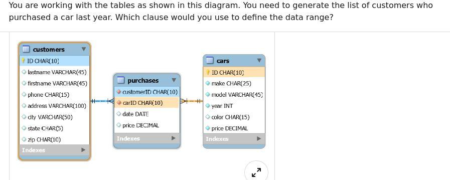

## The Quiz is divided in three parts:

1. **Python**
   - Best Practice 
   - Data types 
   - Coding Skills 
2. **MySQL** 
3. **R** 


_Total of 30 questions, answers available here:_  [Answer Key](https://github.com/explorai/ML-Prerequisites-Quiz/blob/gh-pages/answerKeys.md).   _You are responsible to assess your level of knowledge (Recommended: 70% or better)_

***

## Python (Programming Language)

### Best Practice

#### Q1. A doctest allows for the quality assessment of a code through a simple command (python3 <_filename_>). What is the correct way to write a doctest?

- [ ] A.  

```python
def sum(a, b):
    # a = 1
    # b = 2
    # sum(a, b) = 3

    return a + b
```


- [ ] B. 

```python
def sum(a, b):
"
      a = 1     
      b = 2     
      sum(a, b) = 3     
"

      return a + b
```


- [ ] C. 

```python
def sum(a, b):
'''
      >>> a = 1     
      >>> b = 2     
      >>> sum(a, b)     
      3     
'''

    return a + b
```


- [ ] D. 

```python
def sum(a, b):
    '''
    a = 1
    b = 2
    sum(a, b) = 3
    '''
    return a + b
```

#### Q2. Which statement does NOT describe the object-oriented programming concept of encapsulation?

- [ ] A. It protects the data from outside interference.

- [ ] B. A parent class is encapsulated and no data from the parent class passes on to the child class.

- [ ] C. It keeps data and the methods that can manipulate that data in one place.

- [ ] D. It only allows the data to be changed by methods.

#### Q3. What is the purpose of an if/else statement?

- [ ] A. It tells the computer which chunk of code to run if the instructions you coded are incorrect.

- [ ] B. It runs one chunk of code if all the imports were successful, and another chunk of code if the imports were not successful.

- [ ] C. It executes one chunk of code if a condition is true, but a different chunk of code if the condition is false.

- [ ] D. It tells the computer which chunk of code to run if the is enough memory to handle it, and which chunk of code to run if there is not enough memory to handle it.

#### Q4. What is the term used to describe items that may be passed into a function?

- [ ] A. arguments

- [ ] B. paradigms

- [ ] C. attributes

- [ ] D. decorators


#### Q5. When does a for loop stop iterating?

- [ ] A. when it encounters an infinite loop

- [ ] B. when it encounters an if/else statement that contains a break keyword

- [ ] C. when it has assessed each item in the iterable it is working on or a break keyword is encountered

- [ ] D. when the runtime for the loop exceeds O(n^2)


### Data Types

#### Q1. What is the correct syntax for creating a variable that is bound to a dictionary?

- [ ] A. `fruit_info = {'fruit': 'apple', 'count': 2, 'price': 3.5}`

- [ ] B. `fruit_info =('fruit': 'apple', 'count': 2,'price': 3.5 ).dict()`

- [ ] C. `fruit_info = ['fruit': 'apple', 'count': 2,'price': 3.5 ].dict()`

- [ ] D. `fruit_info = to_dict('fruit': 'apple', 'count': 2, 'price': 3.5)`

#### Q2. What does it mean for a function to have linear runtime?

- [ ] A. You did not use very many advanced computer programming concepts in your code.

- [ ] B. The difficulty level your code is written at is not that high.

- [ ] C. It will take your program less than half a second to run.

- [ ] D. The amount of time it takes the function to complete grows linearly as the input size increases.


#### Q3. Describe the functionality of a deque.

- [ ] A. A deque adds items to one side and remove items from the other side.

- [ ] B. A deque adds items to either or both sides, but only removes items from the top.

- [ ] C. A deque adds items at either or both ends, and remove items at either or both ends.

- [ ] D. A deque adds items only to the top, but remove from either or both sides.

#### Q4. What is the correct syntax for creating a variable that is bound to a set?

- [ ] A. `myset = {0, 'apple', 3.5}`

- [ ] B. `myset = to_set(0, 'apple', 3.5)`

- [ ] C. `myset = (0, 'apple', 3.5).to_set()`

- [ ] D. `myset = (0, 'apple', 3.5).set()`


#### Q5. What data structure does a binary tree degenerate to if it isn't balanced properly?

- [ ] A. linked list

- [ ] B. queue

- [ ] C. set

- [ ] D. OrderedDict


### Coding Skills

#### 1. What happens when you use the build-in function `any()` on a list?

- [ ] A. The `any()` function will randomly return any item from the list.

- [ ] B. The `any()` function returns True if any item in the list evaluates to True. Otherwise, it returns False.

- [ ] C. The `any()` function takes as arguments the list to check inside, and the item to check for. If "any" of the items in the list match the item to check for, the function returns True.

- [ ] D. The `any()` function returns a Boolean value that answers the question "Are there any items in this list?"


#### 2. What statement about static methods is true?

- [ ] A. Static methods are called static because they always return `None`.

- [ ] B. Static methods can be bound to either a class or an instance of a class.

- [ ] C. Static methods serve mostly as utility methods or helper methods, since they can't access or modify a class's state.

- [ ] D. Static methods can access and modify the state of a class or an instance of a class.


#### 3. What are attributes?

- [ ] A. Attributes are long-form version of an `if/else` statement, used when testing for equality between objects.

- [ ] B. Attributes are a way to hold data or describe a state for a class or an instance of a class.

- [ ] C. Attributes are strings that describe characteristics of a class.

- [ ] D. Function arguments are called "attributes" in the context of class methods and instance methods.


#### 4. What is the term to describe this code?

`count, fruit, price = (2, 'apple', 3.5)`

- [ ] A. `tuple assignment`

- [ ] B. `tuple unpacking`

- [ ] C. `tuple matching`

- [ ] D. `tuple duplication`


#### 5. What is one of the most common use of Python's sys library?

- [ ] A. to capture command-line arguments given at a file's runtime

- [ ] B. to connect various systems, such as connecting a web front end, an API service, a database, and a mobile app

- [ ] C. to take a snapshot of all the packages and libraries in your virtual environment

- [ ] D. to scan the health of your Python ecosystem while inside a virtual environment


#### 6. What is the correct syntax for defining a class called Game, if it inherits from a parent class called LogicGame?

- [ ] A. `class Game(LogicGame): pass`

- [ ] B. `def Game(LogicGame): pass`

- [ ] C. `def Game.LogicGame(): pass`

- [ ] D. `class Game.LogicGame(): pass`

#### 7. What would this expression return?

```python
college_years = ['Freshman', 'Sophomore', 'Junior', 'Senior']
return list(enumerate(college_years, 2019))
```

- [ ] A. `[('Freshman', 2019), ('Sophomore', 2020), ('Junior', 2021), ('Senior', 2022)]`

- [ ] B. `[(2019, 2020, 2021, 2022), ('Freshman', 'Sophomore', 'Junior', 'Senior')]`

- [ ] C. `[('Freshman', 'Sophomore', 'Junior', 'Senior'), (2019, 2020, 2021, 2022)]`

- [ ] D. `[(2019, 'Freshman'), (2020, 'Sophomore'), (2021, 'Junior'), (2022, 'Senior')]`


#### 8. What is the correct syntax for defining an `__init__()` method that sets instance-specific attributes upon creation of a new class instance?

- [ ] A.

```python
def __init__(self, attr1, attr2):
    attr1 = attr1
    attr2 = attr2
```


- [ ] B.

```python
def __init__(attr1, attr2):
    attr1 = attr1
    attr2 = attr2
```


- [ ] C.

```python
def __init__(self, attr1, attr2):
    self.attr1 = attr1
    self.attr2 = attr2
```


- [ ] D.

```python
def __init__(attr1, attr2):
    self.attr1 = attr1
    self.attr2 = attr2
```


#### 9. What is the purpose of the "self" keyword when defining or calling instance methods?

- [ ] A. `self` means that no other arguments are required to be passed into the metho

- [ ] B. There is no real purpose for the `self` method; it's just historic computer science jargon that Python keeps to stay consistent with other programming languages.

- [ ] C. `self` refers to the instance whose method was calle

- [ ] D. `self` refers to the class that was inherited from to create the object using `self`.

#### 10. What is an instance method?

- [ ] A. Instance methods can modify the state of an instance or the state of its parent class.

- [ ] B. Instance methods hold data related to the instance.

- [ ] C. An instance method is any class method that doesn't take any arguments.

- [ ] D. An instance method is a regular function that belongs to a class, but it must return `None`.


***

## MySQL

#### Q1. Management has requested that you build an employee database. You start with the employee table. What is the correct syntax?

- [ ] A. 

```sql
    1 CREATE TABLE employee (
    2 employee ID char(10),
    3 firstName varchar(50),
    4 lastName varchar(50),
    5 phone varchar(20),
    6 address varchar(50),
    7 PRIMARY KEY ON employeeID
    8 );
```


- [ ] B. 

```sql
    1 CREATE TABLE employee (
    2 employee ID char(10),
    3 firstName varchar(50),
    4 lastName varchar(50),
    5 phone varchar(20),
    6 address varchar(50),
    7 PRIMARY KEY employeeID
    8 );
```


- [ ] C. 

```sql
    1 CREATE TABLE IF EXISTS employee (
    2 employee ID char(10),
    3 firstName varchar(50),
    4 lastName varchar(50),
    5 phone varchar(20),
    6 address varchar(50),
    7 PRIMARY KEY (employeeID)
    8 );
```


- [ ] D. 

```sql
    1 CREATE TABLE IF NOT EXISTS employee (
    2 employee ID char(10),
    3 firstName varchar(50),
    4 lastName varchar(50),
    5 phone varchar(20),
    6 address varchar(50),
    7 PRIMARY KEY (employeeID)
    8 );
```

#### Q2. You are working with the tables as shown in this diagram. You need to generate the list of customers who purchased certain car models. Which SQL clause do you use?



- [ ] A. LIKE

- [ ] B. IN

- [ ] C. BETWEEN

- [ ] D. HAVING

#### Q3. How does MySQL differ from SQL?

- [ ] A. SQL is a standard language for retrieving and manipulating data from structured databases. MySQL is a nonrelational database management system that is used to manage SQL databases.

- [ ] B. SQL is a standard language for retrieving and manipulating data from structured databases. MySQL is a relational database management system that is used to manage SQL databases.

- [ ] C. They are not different. MySQL and SQL refer to the same thing.

- [ ] D. My SQL is a language, and SQL is a software application.

#### Q4. If you need to order a table of movies by name, which query will work?

- [ ] A. SELECT \* FROM movies GROUP BY name

- [ ] B. SELECT \* FROM movies ORDER BY name

- [ ] C. SELECT \* FROM movies ORDER TABLE by name

- [ ] D. SELECT \* FROM movies FILTER BY name

#### Q5. What does the following SQL statement return?

`SELECT * FROM Employees WHERE EmployeeName LIKE 'a%'`

- [ ] A. It records in the Employees table where the value in the EmployeeName column doesn't have an "a".

- [ ] B. It records in the Employees table where the value in the EmployeeName column starts with "a".

- [ ] C. It records in the Employees table where the value in the EmployeeName column has an "a".

- [ ] D. It records in the Employees table where the value in the EmployeeName column ends with "a".

***

## R (Programming Language)

#### Q1. What is the principal difference between an array and a matrix?


- [ ] A. A matrix has two dimensions, while an array can have three or more dimensions.

- [ ] B. An array is a subtype of the data frame, while a matrix is a separate type entirely.

- [ ] C. A matrix can have columns of different lengths, but an array's columns must all be the same length.

- [ ] D. A matrix may contain numeric values only, while an array can mix different types of values.

#### Q2. What does c contain?

```
a <- c(3,3,6.5,8)
b <- c(7,2,5.5,10)
c <- a < b
```

- [ ] A. [1] NaN

- [ ] B. [1] -4

- [ ] C. [1] 4 -1 -1 2

- [ ] D. [1] TRUE FALSE FALSE TRUE

#### Q3. How does a vector differ from a list?

- [ ] A. Vectors are used only for numeric data, while list are useful for both numeric and string dat- [ ] A.

- [ ] B. Vectors and lists are the same thing and can be used interchangeably.

- [ ] C. A vector contains items of a single data type, while a list can contain items of different data types.

- [ ] D. Vectors are like arrays, while lists are like data frames.

#### Q4. Review line 1 below. What does the statement in line 2 return?

```
1 mylist <- list(1,2,"C",4,5)
2 unlist(mylist)
```

- [ ] A. [1] 1 2 4 5

- [ ] B. "C"

- [ ] C. [1] "1" "2" "C" "4" "5"

- [ ] D. [1] 1 2 C 4 5

#### Q5. What does R return?

```
StartDate<- as.Date("2020/1/8")
StopDate<- as.Date("2020/1/10")
StopDate-StartDate
```

- [ ] A. "1970-01-02"

- [ ] B. time difference of one day

- [ ] C. time difference of two days

- [ ] D. error in x-y: nonnumeric argument to binary operator
