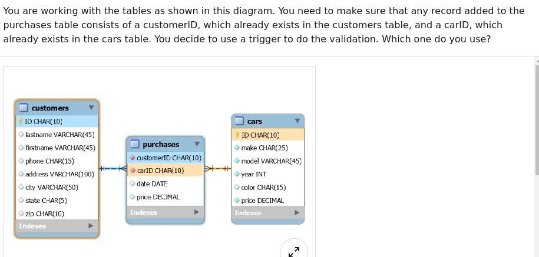
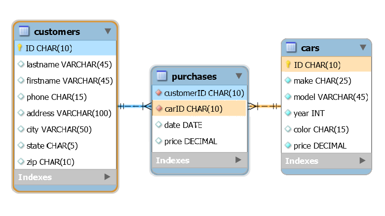

#The Quiz is divided in three parts:

1. Python
2. R
3. MySQL

***

## Python (Programming Language)

#### Q1. What is an abstract class?

- [ ] An abstract class is the name for any class from which you can instantiate an object.
- [ ] Abstract classes must be redefined any time an object is instantiated from them.
- [ ] Abstract classes must inherit from concrete classes.
- [ ] An abstract class exists only so that other "concrete" classes can inherit from the abstract class.

#### Q2. What happens when you use the build-in function `any()` on a list?

- [ ] The `any()` function will randomly return any item from the list.
- [ ] The `any()` function returns True if any item in the list evaluates to True. Otherwise, it returns False.
- [ ] The `any()` function takes as arguments the list to check inside, and the item to check for. If "any" of the items in the list match the item to check for, the function returns True.
- [ ] The `any()` function returns a Boolean value that answers the question "Are there any items in this list?"

#### Q3. What data structure does a binary tree degenerate to if it isn't balanced properly?

- [ ] linked list
- [ ] queue
- [ ] set
- [ ] OrderedDict

#### Q4. What statement about static methods is true?

- [ ] Static methods are called static because they always return `None`.
- [ ] Static methods can be bound to either a class or an instance of a class.
- [ ] Static methods serve mostly as utility methods or helper methods, since they can't access or modify a class's state.
- [ ] Static methods can access and modify the state of a class or an instance of a class.

#### Q5. What are attributes?

- [ ] Attributes are long-form version of an `if/else` statement, used when testing for equality between objects.
- [ ] Attributes are a way to hold data or describe a state for a class or an instance of a class.
- [ ] Attributes are strings that describe characteristics of a class.
- [ ] Function arguments are called "attributes" in the context of class methods and instance methods.

#### Q6. What is the term to describe this code?

`count, fruit, price = (2, 'apple', 3.5)`

- [ ] `tuple assignment`
- [ ] `tuple unpacking`
- [ ] `tuple matching`
- [ ] `tuple duplication`

#### Q7. What built-in list method would you use to remove items from a list?

- [ ] `.delete()` method
- [ ] `pop(my_list)`
- [ ] `del(my_list)`
- [ ] `.pop()` method

#### Q8. What is one of the most common use of Python's sys library?

- [ ] to capture command-line arguments given at a file's runtime
- [ ] to connect various systems, such as connecting a web front end, an API service, a database, and a mobile app
- [ ] to take a snapshot of all the packages and libraries in your virtual environment
- [ ] to scan the health of your Python ecosystem while inside a virtual environment

#### Q9. What is the runtime of accessing a value in a dictionary by using its key?

- [ ] O(n), also called linear time.
- [ ] O(log n), also called logarithmic time.
- [ ] O(n^2), also called quadratic time.
- [ ] O(1), also called constant time.

#### Q10. What is the correct syntax for defining a class called Game, if it inherits from a parent class called LogicGame?

- [ ] `class Game(LogicGame): pass`
- [ ] `def Game(LogicGame): pass`
- [ ] `def Game.LogicGame(): pass`
- [ ] `class Game.LogicGame(): pass`

**Explanation:** `The parent class which is inherited is passed as an argument to the child class. Therefore, here the first option is the right answer.`

#### Q11. What is the correct way to write a doctest?

- [ ] A

```python
def sum(a, b):
    """
    sum(4, 3)
    7

    sum(-4, 5)
    1
    """
    return a + b
```

- [ ] B

```python
def sum(a, b):
    """
    >>> sum(4, 3)
    7

    >>> sum(-4, 5)
    1
    """
    return a + b
```

- [ ] C

```python
def sum(a, b):
    """
    # >>> sum(4, 3)
    # 7

    # >>> sum(-4, 5)
    # 1
    """
    return a + b
```

- [ ] D

```python
def sum(a, b):
    ###
    >>> sum(4, 3)
    7

    >>> sum(-4, 5)
    1
    ###
    return a + b
```

#### Q12. What built-in Python data type is commonly used to represent a stack?

- [ ] `set`
- [ ] `list`
- [ ] `None`
- [ ] `dictionary`

`. You can only build a stack from scratch.`

#### Q13. What would this expression return?

```python
college_years = ['Freshman', 'Sophomore', 'Junior', 'Senior']
return list(enumerate(college_years, 2019))
```

- [ ] `[('Freshman', 2019), ('Sophomore', 2020), ('Junior', 2021), ('Senior', 2022)]`
- [ ] `[(2019, 2020, 2021, 2022), ('Freshman', 'Sophomore', 'Junior', 'Senior')]`
- [ ] `[('Freshman', 'Sophomore', 'Junior', 'Senior'), (2019, 2020, 2021, 2022)]`
- [ ] `[(2019, 'Freshman'), (2020, 'Sophomore'), (2021, 'Junior'), (2022, 'Senior')]`

#### Q14. How does `defaultdict` work?

- [ ] `defaultdict` will automatically create a dictionary for you that has keys which are the integers 0-10.
- [ ] `defaultdict` forces a dictionary to only accept keys that are of the types specified when you created the `defaultdict` (such as string or integers).
- [ ] If you try to access a key in a dictionary that doesn't exist, `defaultdict` will create a new key for you instead of throwing a `KeyError`.
- [ ] `defaultdict` stores a copy of a dictionary in memory that you can default to if the original gets unintentionally modified.

#### Q15. What is the correct syntax for defining a class called "Game", if it inherits from a parent class called "LogicGame"?

- [ ] `class Game.LogicGame(): pass`
- [ ] `def Game(LogicGame): pass`
- [ ] `class Game(LogicGame): pass`
- [ ] `def Game.LogicGame(): pass`

#### Q16. What is the purpose of the "self" keyword when defining or calling instance methods?

- [ ] `self` means that no other arguments are required to be passed into the method.
- [ ] There is no real purpose for the `self` method; it's just historic computer science jargon that Python keeps to stay consistent with other programming languages.
- [ ] `self` refers to the instance whose method was called.
- [ ] `self` refers to the class that was inherited from to create the object using `self`.

#### Q17. Which of these is NOT a characteristic of namedtuples?

- [ ] You can assign a name to each of the `namedtuple` members and refer to them that way, similarly to how you would access keys in `dictionary`.
- [ ] Each member of a namedtuple object can be indexed to directly, just like in a regular `tuple`.
- [ ] `namedtuples` are just as memory efficient as regular `tuples`.
- [ ] No import is needed to use `namedtuples` because they are available in the standard library.

#### Q18. What is an instance method?

- [ ] Instance methods can modify the state of an instance or the state of its parent class.
- [ ] Instance methods hold data related to the instance.
- [ ] An instance method is any class method that doesn't take any arguments.
- [ ] An instance method is a regular function that belongs to a class, but it must return `None`.

#### Q19. Which choice is the most syntactically correct example of the conditional branching?

- [ ]

```python
num_people = 5

if num_people > 10:
    print("There is a lot of people in the pool.")
elif num_people > 4;
    print("There are some people in the pool.")
elif num_people > 0;
    print("There are a few people in the pool.")
else:
    print("There is no one in the pool.")
```

- [ ]

```python
num_people = 5

if num_people > 10:
    print("There is a lot of people in the pool.")
if num_people > 4:
    print("There are some people in the pool.")
if num_people > 0:
    print("There are a few people in the pool.")
else:
    print("There is no one in the pool.")
```

- [ ]

```python
num_people = 5

if num_people > 10:
    print("There is a lot of people in the pool.")
elif num_people > 4:
    print("There are some people in the pool.")
elif num_people > 0:
    print("There are a few people in the pool.")
else:
    print("There is no one in the pool.")
```

- [ ]

```python
if num_people > 10;
    print("There is a lot of people in the pool.")
if num_people > 4:
    print("There are some people in the pool.")
if num_people > 0:
    print("There are a few people in the pool.")
else:
    print("There is no one in the pool.")
```

Also see Question 85 for the same question with different answers.

#### Q20. Which statement does NOT describe the object-oriented programming concept of encapsulation?

- [ ] It protects the data from outside interference.
- [ ] A parent class is encapsulated and no data from the parent class passes on to the child class.
- [ ] It keeps data and the methods that can manipulate that data in one place.
- [ ] It only allows the data to be changed by methods.

#### Q21. What is the purpose of an if/else statement?

- [ ] It tells the computer which chunk of code to run if the instructions you coded are incorrect.
- [ ] It runs one chunk of code if all the imports were successful, and another chunk of code if the imports were not successful.
- [ ] It executes one chunk of code if a condition is true, but a different chunk of code if the condition is false.
- [ ] It tells the computer which chunk of code to run if the is enough memory to handle it, and which chunk of code to run if there is not enough memory to handle it.

#### Q22. What built-in Python data type is best suited for implementing a queue?

- [ ] dictionary
- [ ] set
- [ ] None. You can only build a queue from scratch.
- [ ] list

#### Q23. What is the correct syntax for instantiating a new object of the type Game?

- [ ] `my_game = class.Game()`
- [ ] `my_game = class(Game)`
- [ ] `my_game = Game()`
- [ ] `my_game = Game.create()`

#### Q24. What does the built-in `map()` function do?

- [ ] It creates a path from multiple values in an iterable to a single value.
- [ ] It applies a function to each item in an iterable and returns the value of that function.
- [ ] It converts a complex value type into simpler value types.
- [ ] It creates a mapping between two different elements of different iterables.

#### Q25. If you don't explicitly return a value from a function, what happens?

- [ ] The function will return a RuntimeError if you don't return a value.
- [ ] If the return keyword is absent, the function will return `None`.
- [ ] If the return keyword is absent, the function will return `True`.
- [ ] The function will enter an infinite loop because it won't know when to stop executing its code.

#### Q26. What is the purpose of the `pass` statement in Python?

- [ ] It is used to skip the `yield` statement of a generator and return a value of None.
- [ ] It is a null operation used mainly as a placeholder in functions, classes, etc.
- [ ] It is used to pass control from one statement block to another.
- [ ] It is used to skip the rest of a `while` or `for loop` and return to the start of the loop.

#### Q27. What is the term used to describe items that may be passed into a function?

- [ ] arguments
- [ ] paradigms
- [ ] attributes
- [ ] decorators

#### Q28. Which collection type is used to associate values with unique keys?

- [ ] `slot`
- [ ] `dictionary`
- [ ] `queue`
- [ ] `sorted list`

#### Q29. When does a for loop stop iterating?

- [ ] when it encounters an infinite loop
- [ ] when it encounters an if/else statement that contains a break keyword
- [ ] when it has assessed each item in the iterable it is working on or a break keyword is encountered
- [ ] when the runtime for the loop exceeds O(n^2)

#### Q30. Assuming the node is in a singly linked list, what is the runtime complexity of searching for a specific node within a singly linked list?

- [ ] The runtime is O(n) because in the worst case, the node you are searching for is the last node, and every node in the linked list must be visited.
- [ ] The runtime is O(nk), with n representing the number of nodes and k representing the amount of time it takes to access each node in memory.
- [ ] The runtime cannot be determined unless you know how many nodes are in the singly linked list.
- [ ] The runtime is O(1) because you can index directly to a node in a singly linked list.

#### Q31. Given the following three list, how would you create a new list that matches the desired output printed below?

```python
fruits = ['Apples', 'Oranges', 'Bananas']
quantities = [5, 3, 4]
prices = [1.50, 2.25, 0.89]

#Desired output
[('Apples', 5, 1.50),
('Oranges', 3, 2.25),
('Bananas', 4, 0.89)]
```

- [ ]

```python
output = []

fruit_tuple_0 = (first[0], quantities[0], price[0])
output.append(fruit_tuple)

fruit_tuple_1 = (first[1], quantities[1], price[1])
output.append(fruit_tuple)

fruit_tuple_2 = (first[2], quantities[2], price[2])
output.append(fruit_tuple)

return output
```

- [ ]

```python
i = 0
output = []
for fruit in fruits:
    temp_qty = quantities[i]
    temp_price = prices[i]
    output.append((fruit, temp_qty, temp_price))
    i += 1
return output
```

- [ ]

```python
groceries = zip(fruits, quantities, prices)
return groceries

>>> [
('Apples', 5, 1.50),
('Oranges', 3, 2.25),
('Bananas', 4, 0.89)
]
```

- [ ]

```python
i = 0
output = []
for fruit in fruits:
    for qty in quantities:
        for price in prices:
            output.append((fruit, qty, price))
    i += 1
return output
```

#### Q32. What happens when you use the built-in function all() on a list?

- [ ] The `all()` function returns a Boolean value that answers the question "Are all the items in this list the same?
- [ ] The `all()` function returns True if all the items in the list can be converted to strings. Otherwise, it returns False.
- [ ] The `all()` function will return all the values in the list.
- [ ] The `all()` function returns True if all items in the list evaluate to True. Otherwise, it returns False.

#### Q33. What is the correct syntax for calling an instance method on a class named Game?

_(Answer format may vary. Game and roll (or dice_roll) should each be called with no parameters.)_

- [ ]

```python
>>> dice = Game()
>>> dice.roll()
```

- [ ]

```python
>>> dice = Game(self)
>>> dice.roll(self)
```

- [ ]

```python
>>> dice = Game()
>>> dice.roll(self)
```

- [ ]

```python
>>> dice = Game(self)
>>> dice.roll()
```

#### Q34. What is the algorithmic paradigm of quick sort?

- [ ] backtracking
- [ ] dynamic programming
- [ ] decrease and conquer
- [ ] divide and conquer

#### Q35. What is runtime complexity of the list's built-in `.append()` method?

- [ ] O(1), also called constant time
- [ ] O(log n), also called logarithmic time
- [ ] O(n^2), also called quadratic time
- [ ] O(n), also called linear time

#### Q36. What is key difference between a `set` and a `list`?

- [ ] A set is an ordered collection unique items. A list is an unordered collection of non-unique items.
- [ ] Elements can be retrieved from a list but they cannot be retrieved from a set.
- [ ] A set is an ordered collection of non-unique items. A list is an unordered collection of unique items.
- [ ] A set is an unordered collection unique items. A list is an ordered collection of non-unique items.

#### Q37. What is the definition of abstraction as applied to object-oriented Python?

- [ ] Abstraction means that a different style of code can be used, since many details are already known to the program behind the scenes.
- [ ] Abstraction means the implementation is hidden from the user, and only the relevant data or information is shown.
- [ ] Abstraction means that the data and the functionality of a class are combined into one entity.
- [ ] Abstraction means that a class can inherit from more than one parent class.

#### Q38. What does this function print?

```python
def print_alpha_nums(abc_list, num_list):
    for char in abc_list:
        for num in num_list:
            print(char, num)
    return

print_alpha_nums(['a', 'b', 'c'], [1, 2, 3])
```

- [ ]

```python
a 1
a 2
a 3
b 1
b 2
b 3
c 1
c 2
c 3
```

- [ ]

```python
['a', 'b', 'c'], [1, 2, 3]
```

- [ ]

```python
aaa
bbb
ccc
111
222
333
```

- [ ]

```python
a 1 2 3
b 1 2 3
c 1 2 3
```

#### Q39. Correct representation of doctest for function in Python

- [ ]

```python
def sum(a, b):
    # a = 1
    # b = 2
    # sum(a, b) = 3

    return a + b
```

- [ ]

```python
def sum(a, b):
    """
    a = 1
    b = 2
    sum(a, b) = 3
    """

    return a + b
```

- [ ]

```python
def sum(a, b):
    """
    >>> a = 1
    >>> b = 2
    >>> sum(a, b)
    3
    """

    return a + b
```

- [ ]

```python
def sum(a, b):
    '''
    a = 1
    b = 2
    sum(a, b) = 3
    '''
    return a + b
```

#### Q40. Suppose a Game class inherits from two parent classes: BoardGame and LogicGame. Which statement is true about the methods of an object instantiated from the Game class?

- [ ] When instantiating an object, the object doesn't inherit any of the parent class's methods.
- [ ] When instantiating an object, the object will inherit the methods of whichever parent class has more methods.
- [ ] When instantiating an object, the programmer must specify which parent class to inherit methods from.
- [ ] An instance of the Game class will inherit whatever methods the BoardGame and LogicGame classes have.

#### Q41. What does calling namedtuple on a collection type return?

- [ ] a generic object class with iterable parameter fields
- [ ] a generic object class with non-iterable named fields
- [ ] a tuple subclass with non-iterable parameter fields
- [ ] a tuple subclass with iterable named fields

#### Q42. What symbol(s) do you use to assess equality between two elements?

- [ ] `&&`
- [ ] `=`
- [ ] `==`
- [ ] `||`

#### Q43. Review the code below. What is the correct syntax for changing the price to 1.5?

```python
fruit_info = {
  'fruit': 'apple',
  'count': 2,
  'price': 3.5
}
```

- [ ] `fruit_info ['price'] = 1.5`
- [ ] `my_list [3.5] = 1.5`
- [ ] `1.5 = fruit_info ['price]`
- [ ] `my_list['price'] == 1.5`

#### Q44. What value would be returned by this check for equality?

`5 != 6`

- [ ] `yes`
- [ ] `False`
- [ ] `True`
- [ ] `None`

#### Q45. What does a class's `init()` method do?

- [ ] The `__init__` method makes classes aware of each other if more than one class is defined in a single code file.
- [ ] The`__init__` method is included to preserve backwards compatibility from Python 3 to Python 2, but no longer needs to be used in Python 3.
- [ ] The `__init__` method is a constructor method that is called automatically whenever a new object is created from a class. It sets the initial state of a new object.
- [ ] The `__init__` method initializes any imports you may have included at the top of your file.

#### Q46. What is meant by the phrase "space complexity"?

- [ ] `How many microprocessors it would take to run your code in less than one second`
- [ ] `How many lines of code are in your code file`
- [ ] `The amount of space taken up in memory as a function of the input size`
- [ ] `How many copies of the code file could fit in 1 GB of memory`

#### Q47. What is the correct syntax for creating a variable that is bound to a dictionary?

- [ ] `fruit_info = {'fruit': 'apple', 'count': 2, 'price': 3.5}`
- [ ] `fruit_info =('fruit': 'apple', 'count': 2,'price': 3.5 ).dict()`
- [ ] `fruit_info = ['fruit': 'apple', 'count': 2,'price': 3.5 ].dict()`
- [ ] `fruit_info = to_dict('fruit': 'apple', 'count': 2, 'price': 3.5)`

#### Q48. What is the proper way to write a list comprehension that represents all the keys in this dictionary?

`fruits = {'Apples': 5, 'Oranges': 3, 'Bananas': 4}`

- [ ] `fruit_names = [x in fruits.keys() for x]`
- [ ] `fruit_names = for x in fruits.keys() *`
- [ ] `fruit_names = [x for x in fruits.keys()]`
- [ ] `fruit_names = x for x in fruits.keys()`

#### Q49. What is the purpose of the `self` keyword when defining or calling methods on an instance of an object?

- [ ] `self` refers to the class that was inherited from to create the object using `self`.
- [ ] There is no real purpose for the `self` method. It's just legacy computer science jargon that Python keeps to stay consistent with other programming languages.
- [ ] `self` means that no other arguments are required to be passed into the method.
- [ ] `self` refers to the instance whose method was called.

#### Q50. What statement about the class methods is true?

- [ ] A class method is a regular function that belongs to a class, but it must return None.
- [ ] A class method can modify the state of the class, but they can't directly modify the state of an instance that inherits from that class.
- [ ] A class method is similar to a regular function, but a class method doesn't take any arguments.
- [ ] A class method hold all of the data for a particular class.

#### Q51. What does it mean for a function to have linear runtime?

- [ ] You did not use very many advanced computer programming concepts in your code.
- [ ] The difficulty level your code is written at is not that high.
- [ ] It will take your program less than half a second to run.
- [ ] The amount of time it takes the function to complete grows linearly as the input size increases.

#### Q52. What is the proper way to define a function?

- [ ] `def getMaxNum(list_of_nums): # body of function goes here`
- [ ] `func get_max_num(list_of_nums): # body of function goes here`
- [ ] `func getMaxNum(list_of_nums): # body of function goes here`
- [ ] `def get_max_num(list_of_nums): # body of function goes here`

[explanation](https://www.python.org/dev/peps/pep-0008/)

#### Q53. According to the PEP 8 coding style guidelines, how should constant values be named in Python?

- [ ] in camel case without using underscores to separate words -- e.g. `maxValue = 255`
- [ ] in lowercase with underscores to separate words -- e.g. `max_value = 255`
- [ ] in all caps with underscores separating words -- e.g. `MAX_VALUE = 255`
- [ ] in mixed case without using underscores to separate words -- e.g. `MaxValue = 255`

#### Q54. Describe the functionality of a deque.

- [ ] A deque adds items to one side and remove items from the other side.
- [ ] A deque adds items to either or both sides, but only removes items from the top.
- [ ] A deque adds items at either or both ends, and remove items at either or both ends.
- [ ] A deque adds items only to the top, but remove from either or both sides.

#### Q55. What is the correct syntax for creating a variable that is bound to a set?

- [ ] `myset = {0, 'apple', 3.5}`
- [ ] `myset = to_set(0, 'apple', 3.5)`
- [ ] `myset = (0, 'apple', 3.5).to_set()`
- [ ] `myset = (0, 'apple', 3.5).set()`

#### Q56. What is the correct syntax for defining an `__init__()` method that takes no parameters?

- [ ]

```python
class __init__(self):
    pass
```

- [ ]

```python
def __init__():
    pass
```

- [ ]

```python
class __init__():
    pass
```

- [ ]

```python
def __init__(self):
    pass
```

#### Q57. Which of the following is TRUE About how numeric data would be organised in a binary Search tree?

- [ ] For any given Node in a binary Search Tree, the child node to the left is less than the value of the given node and the child node to its right is greater than the given node.
- [ ] Binary Search Tree cannot be used to organize and search through numeric data, given the complication that arise with very deep trees.
- [ ] The top node of the binary search tree would be an arbitrary number. All the nodes to the left of the top node need to be less than the top node's number, but they don't need to ordered in any particular way.
- [ ] The smallest numeric value would go in the top most node. The next highest number would go in its left child node, the the next highest number after that would go in its right child node. This pattern would continue until all numeric values were in their own node.

#### Q58. Why would you use a decorator?

- [ ] A decorator is similar to a class and should be used if you are doing functional programming instead of object oriented programming.
- [ ] A decorator is a visual indicator to someone reading your code that a portion of your code is critical and should not be changed.
- [ ] You use the decorator to alter the functionality of a function without having to modify the functions code.
- [ ] An import statement is preceded by a decorator, python knows to import the most recent version of whatever package or library is being imported.

#### Q59. When would you use a for loop?

- [ ] Only in some situations, as loops are used only for certain type of programming.
- [ ] When you need to check every element in an iterable of known length.
- [ ] When you want to minimize the use of strings in your code.
- [ ] When you want to run code in one file for a function in another file.

#### Q60. What is the most self-descriptive way to define a function that calculates sales tax on a purchase?

- [ ]

```python
def tax(my_float):
    '''Calculates the sales tax of a purchase. Takes in a float representing the subtotal as an argument and returns a float representing the sales tax.'''
    pass
```

- [ ]

```python
def tx(amt):
    '''Gets the tax on an amount.'''
```

- [ ]

```python
def sales_tax(amount):
    '''Calculates the sales tax of a purchase. Takes in a float representing the subtotal as an argument and returns a float representing the sales tax.'''
```

- [ ]

```python
def calculate_sales_tax(subtotal):
    pass
```

#### Q61. What would happen if you did not alter the state of the element that an algorithm is operating on recursively?

- [ ] You do not have to alter the state of the element the algorithm is recursing on.
- [ ] You would eventually get a KeyError when the recursive portion of the code ran out of items to recurse on.
- [ ] You would get a RuntimeError: maximum recursion depth exceeded.
- [ ] The function using recursion would return None.

#### Q62. What is the runtime complexity of searching for an item in a binary search tree?

- [ ] The runtime for searching in a binary search tree is O(1) because each node acts as a key, similar to a dictionary.
- [ ] The runtime for searching in a binary search tree is O(n!) because every node must be compared to every other node.
- [ ] The runtime for searching in a binary search tree is generally O(h), where h is the height of the tree.
- [ ] The runtime for searching in a binary search tree is O(n) because every node in the tree must be visited.

#### Q63. Why would you use `mixin`?

- [ ] You use a `mixin` to force a function to accept an argument at runtime even if the argument wasn't included in the function's definition.
- [ ] You use a `mixin` to allow a decorator to accept keyword arguments.
- [ ] You use a `mixin` to make sure that a class's attributes and methods don't interfere with global variables and functions.
- [ ] If you have many classes that all need to have the same functionality, you'd use a `mixin` to define that functionality.

#### Q64. What is the runtime complexity of adding an item to a stack and removing an item from a stack?

- [ ] Add items to a stack in O(1) time and remove items from a stack on O(n) time.
- [ ] Add items to a stack in O(1) time and remove items from a stack in O(1) time.
- [ ] Add items to a stack in O(n) time and remove items from a stack on O(1) time.
- [ ] Add items to a stack in O(n) time and remove items from a stack on O(n) time.

#### Q65. Which statement accurately describes how items are added to and removed from a stack?

- [ ] a stacks adds items to one side and removes items from the other side.
- [ ] a stacks adds items to the top and removes items from the top.
- [ ] a stacks adds items to the top and removes items from anywhere in the stack.
- [ ] a stacks adds items to either end and removes items from either end.

#### Q66. What is a base case in a recursive function?

- [ ] A base case is the condition that allows the algorithm to stop recursing. It is usually a problem that is small enough to solve directly.
- [ ] The base case is summary of the overall problem that needs to be solved.
- [ ] The base case is passed in as an argument to a function whose body makes use of recursion.
- [ ] The base case is similar to a base class, in that it can be inherited by another object.

#### Q67. Why is it considered good practice to open a file from within a Python script by using the `with` keyword?

- [ ] The `with` keyword lets you choose which application to open the file in.
- [ ] The `with` keyword acts like a `for` loop, and lets you access each line in the file one by one.
- [ ] There is no benefit to using the `with` keyword for opening a file in Python.
- [ ] When you open a file using the `with` keyword in Python, Python will make sure the file gets closed, even if an exception or error is thrown.

#### Q68. Why would you use a virtual environment?

- [ ] Virtual environments create a "bubble" around your project so that any libraries or packages you install within it don't affect your entire machine.
- [ ] Teams with remote employees use virtual environments so they can share code, do code reviews, and collaborate remotely.
- [ ] Virtual environments were common in Python 2 because they augmented missing features in the language. Virtual environments are not necessary in Python 3 due to advancements in the language.
- [ ] Virtual environments are tied to your GitHub or Bitbucket account, allowing you to access any of your repos virtually from any machine.

#### Q69. What is the correct way to run all the doctests in a given file from the command line?

- [ ] python3 -m doctest <_filename_>
- [ ] python3 <_filename_>
- [ ] python3 <_filename_> rundoctests
- [ ] python3 doctest

#### Q70. What is a lambda function ?

- [ ] any function that makes use of scientific or mathematical constants, often represented by Greek letters in academic writing
- [ ] a function that get executed when decorators are used
- [ ] any function whose definition is contained within five lines of code or fewer
- [ ] a small, anonymous function that can take any number of arguments but has only expression to evaluate

[Reference](https://www.guru99.com/python-lambda-function.html)

**Explanation:**
`the lambda notation is basically an anonymous function that can take any number of arguments with only single expression (i.e, cannot be overloaded). It has been introducted in other programming languages, such as C++ and Java. The lambda notation allows programmers to "bypass" function declaration.`

#### Q71. What is the primary difference between lists and tuples?

- [ ] You can access a specifc element in a list by indexing to its position, but you cannot access a specific element in a tuple unless you iterate through the tuple
- [ ] Lists are mutable, meaning you can change the data that is inside them at any time. Tuples are immutable, meaning you cannot change the data that is inside them once you have created the tuple.
- [ ] Lists are immutable, meaning you cannot change the data that is inside them once you have created the list. Tuples are mutable, meaning you can change the data that is inside them at any time.
- [ ] Lists can hold several data types inside them at once, but tuples can only hold the same data type if multiple elements are present.

#### Q72. Which statement about static method is true?

- [ ] Static methods can be bound to either a class or an instance of a class.
- [ ] Static methods can access and modify the state of a class or an instance of a class.
- [ ] Static methods serve mostly as utility or helper methods, since they cannot access or modify a class's state.
- [ ] Static methods are called static because they always return None.

#### Q73. What does a generator return?

- [ ] None
- [ ] An iterable object
- [ ] A linked list data structure from a non-empty list
- [ ] All the keys of the given dictionary

#### Q74. What is the difference between class attributes and instance attributes?

- [ ] Instance attributes can be changed, but class attributes cannot be changed
- [ ] Class attributes are shared by all instances of the class. Instance attributes may be unique to just that instance
- [ ] There is no difference between class attributes and instance attributes
- [ ] Class attributes belong just to the class, not to instance of that class. Instance attributes are shared among all instances of a class

#### Q75. What is the correct syntax of creating an instance method?

- [ ]

```python
def get_next_card():
  # method body goes here
```

- [ ]

```python
def get_next_card(self):
  # method body goes here
```

- [ ]

```python
def self.get_next_card():
  # method body goes here
```

- [ ]

```python
def self.get_next_card(self):
  # method body goes here
```

#### Q76. What is the correct way to call a function?

- [ ] get_max_num([57, 99, 31, 18])
- [ ] call.(get_max_num)
- [ ] def get_max_num([57, 99, 31, 18])
- [ ] call.get_max_num([57, 99, 31, 18])

#### Q77. How is comment created?

- [ ] `-- This is a comment`
- [ ] `# This is a comment`
- [ ] `/_ This is a comment _\`
- [ ] `// This is a comment`

#### Q78. What is the correct syntax for replacing the string apple in the list with the string orange?

- [ ] orange = my_list[1]
- [ ] my_list[1] = 'orange'
- [ ] my_list['orange'] = 1
- [ ] my_list[1] == orange

#### Q79. What will happen if you use a while loop and forget to include logic that eventually causes the while loop to stop?

- [ ] Nothing will happen; your computer knows when to stop running the code in the while loop.
- [ ] You will get a KeyError.
- [ ] Your code will get stuck in an infinite loop.
- [ ] You will get a WhileLoopError.

#### Q80. Describe the functionality of a queue?

- [ ] A queue adds items to either end and removes items from either end.
- [ ] A queue adds items to the top and removes items from the top.
- [ ] A queue adds items to the top, and removes items from anywhere in, a list.
- [ ] A queue adds items to the top and removes items from anywhere in the queue.

#### Q81. Which choice is the most syntactically correct example of the conditional branching?

- [ ]

```python
num_people = 5

if num_people > 10:
    print("There is a lot of people in the pool.")
elif num_people > 4:
    print("There are some people in the pool.")
else:
    print("There is no one in the pool.")
```

- [ ]

```python
num_people = 5

if num_people > 10:
    print("There is a lot of people in the pool.")
if num_people > 4:
    print("There are some people in the pool.")
else:
    print("There is no one in the pool.")
```

- [ ]

```python
num_people = 5

if num_people > 10;
    print("There is a lot of people in the pool.")
elif num_people > 4;
    print("There are some people in the pool.")
else;
    print("There is no one in the pool.")
```

- [ ]

```python
if num_people > 10;
    print("There is a lot of people in the pool.")
if num_people > 4;
    print("There are some people in the pool.")
else;
    print("There is no one in the pool.")
```

This question seems to be an updated version of Question 19.

#### Q82. How does `defaultdict` work?

- [ ] `defaultdict` will automatically create a dictionary for you that has keys which are the integers 0-10.
- [ ] `defaultdict` forces a dictionary to only accept keys that are of the types specified when you created the `defaultdict` (such as strings or integers).
- [ ] If you try to read from a `defaultdict` with a nonexistent key, a new default key-value pair will be created for you instead of throwing a `KeyError`.
- [ ] `defaultdict` stores a copy of a dictionary in memory that you can default to if the original gets unintentionally modified.

Updated version of Question 14.

#### Q83. What is the correct syntax for adding a key called `variety` to the `fruit_info` dictionary that has a value of `Red Delicious`?

- [ ] `fruit_info['variety'] == 'Red Delicious'`
- [ ] `fruit_info['variety'] = 'Red Delicious'`
- [ ] `red_delicious = fruit_info['variety']`
- [ ] `red_delicious == fruit_info['variety']`

#### Q84. When would you use a `while` loop?

- [ ] when you want to minimize the use of strings in your code
- [ ] when you want to run code in one file while code in another file is also running
- [ ] when you want some code to continue running as long as some condition is true
- [ ] when you need to run two or more chunks of code at once within the same file

#### Q85. What is the correct syntax for defining an `__init__()` method that sets instance-specific attributes upon creation of a new class instance?

- [ ]

```python
def __init__(self, attr1, attr2):
    attr1 = attr1
    attr2 = attr2
```

- [ ]

```python
def __init__(attr1, attr2):
    attr1 = attr1
    attr2 = attr2
```

- [ ]

```python
def __init__(self, attr1, attr2):
    self.attr1 = attr1
    self.attr2 = attr2
```

- [ ]

```python
def __init__(attr1, attr2):
    self.attr1 = attr1
    self.attr2 = attr2
```

**Explanation**: When instantiating a new object from a given class, the `__init__()` method will take both `attr1` and `attr2`, and set its values to their corresponding object attribute, that's why the need of using `self.attr1 = attr1` instead of `attr1 = attr1`.


***

## R (Programming Language)

#### Q1. How does a matrix differ from a data frame?

- [ ] A matrix may contain numeric values only.
- [ ] A matrix must not be singular.
- [ ] A data frame may contain variables that have different modes.
- [ ] A data frame may contain variables of different lengths.

#### Q2. What value does this statement return?

`unclass(as.Date("1971-01-01"))`

- [ ] 1
- [ ] 365
- [ ] 4
- [ ] 12

#### Q3. What do you use to take an object such as a data frame out of the workspace?

- [ ] remove()
- [ ] erase()
- [ ] detach()
- [ ] delete()

#### Q4. Review the following code. What is the result of line 3?

```
xvect<-c(1,2,3)
xvect[2] <- "2"
xvect
```

- [ ] [1] 1 2 3
- [ ] [1] "1" 2 "3"
- [ ] [1] "1" "2" "3"
- [ ] [1] 7 9

#### Q5. The variable height is a numeric vector in the code below. Which statement returns the value 35?

- [ ] `height(length(height))`
- [ ] `height[length(height)]`
- [ ] `height[length[height]]`
- [ ] `height(5)`

#### Q6. In the image below, the data frame is named rates. The statement `sd(rates[, 2])` returns 39. As what does R regard Ellen's product ratings?


- [ ] sample with replacement
- [ ] population
- [ ] trimmed sample
- [ ] sample <-- not sure

#### Q7. Which choice does R regard as an acceptable name for a variable?

- [ ] `Var_A!`
- [ ] `\_VarA`
- [ ] `.2Var_A`
- [ ] `Var2_A`

#### Q8. What is the principal difference between an array and a matrix?

- [ ] A matrix has two dimensions, while an array can have three or more dimensions.
- [ ] An array is a subtype of the data frame, while a matrix is a separate type entirely.
- [ ] A matrix can have columns of different lengths, but an array's columns must all be the same length.
- [ ] A matrix may contain numeric values only, while an array can mix different types of values.

#### Q9. Which is not a property of lists and vectors?

- [ ] type
- [ ] length
- [ ] attributes
- [ ] scalar

#### Q10. In the image below, the data frame on lines 1 through 4 is names StDf. State and Capital are both factors. Which statement returns the results shown on lines 6 and 7?


- [ ] StDf[1:2,-3]
- [ ] StDf[1:2,1]
- [ ] StDf[1:2,]
- [ ] StDf[1,2,]

#### Q11. Which function displays the first five rows of the data frame named pizza?

- [ ] BOF(pizza, 5)
- [ ] first(pizza, 5)
- [ ] top(pizza, 5)
- [ ] head(pizza, 5)

#### Q12. You accidentally display a large data frame on the R console, losing all the statements you entered during the current session. What is the best way to get the prior 25 statements back?

- [ ] console(-25)
- [ ] console(reverse=TRUE)
- [ ] history()
- [ ] history(max.show = 25)

#### Q13. d.pizza is a data frame. It's column named temperature contains only numbers. If u extract temperature using the [] accessors, its class defaults to numeric. How can you access temperature so that it retains the class of data.frame?

```
> class( d.pizza[ , "temperature" ] )
> "numeric"
```

- [ ] `class( d.pizza( , "temperature" ) )`
- [ ] `class( d.pizza[ , "temperature" ] )`
- [ ] `class( d.pizza$temperature )`
- [ ] `class( d.pizza[ , "temperature", drop=F ] )`

#### Q14. What does c contain?

```
a <- c(3,3,6.5,8)
b <- c(7,2,5.5,10)
c <- a < b
```

- [ ] [1] NaN
- [ ] [1] -4
- [ ] [1] 4 -1 -1 2
- [ ] [1] TRUE FALSE FALSE TRUE

#### Q15. Review the statements below. Does the use of the dim function change the class of y, and if so what is y's new class?

```
> y <- 1:9
> dim(y) <- c(3,3)
```

- [ ] No, y's new class is "array".
- [ ] Yes, y's new class is "matrix".
- [ ] No, y's new class is "vector".
- [ ] Yes, y's new class is "integer".

#### Q16. What is `mydf$y` in this code?

`mydf <- data.frame(x=1:3, y=c("a","b","c"), stringAsFactors=FALSE)`

- [ ] list
- [ ] string
- [ ] factor
- [ ] character vector

#### Q17. How does a vector differ from a list?

- [ ] Vectors are used only for numeric data, while list are useful for both numeric and string data.
- [ ] Vectors and lists are the same thing and can be used interchangeably.
- [ ] A vector contains items of a single data type, while a list can contain items of different data types.
- [ ] Vectors are like arrays, while lists are like data frames.

#### Q18. What statement shows the objects on your workspace?

- [ ] list.objects()
- [ ] print.objects()
- [ ] getws()
- [ ] ls()

#### Q19. What function joins two or more column vectors to form a data frame?

- [ ] rbind()
- [ ] cbind()
- [ ] bind()
- [ ] coerce()

#### Q20. Review line 1 below. What does the statement in line 2 return?

```
1 mylist <- list(1,2,"C",4,5)
2 unlist(mylist)
```

- [ ] [1] 1 2 4 5
- [ ] "C"
- [ ] [1] "1" "2" "C" "4" "5"
- [ ] [1] 1 2 C 4 5

#### Q21. What is the value of y in this code?

```
x <- NA
y <- x/1
```

- [ ] Inf
- [ ] Null
- [ ] NaN
- [ ] NA

#### Q22. Two variable in the mydata data frame are named Var1 and Var2. How do you tell a bivariate function, such as cor.test, which two variables you want to analyze?

- [ ] `cor.test(Var1 ~ Var2)`
- [ ] `cor.test(mydata$(Var1,Var2))`
- [ ] `cor.test(mydata$Var1,mydata$Var2)`
- [ ] `cor.test(Var1,Var2, mydata)`

#### Q23. A data frame named d.pizza is part of the DescTools package. A statement is missing from the following R code and an error is therefore likely to occur. Which statement is missing?

```
library(DescTools)
deliver <- aggregate(count,by=list(area,driver), FUN=mean)
print(deliver)
```

- [ ] `attach(d.pizza)`
- [ ] `summarize(deliver)`
- [ ] `mean <- rbind(d.pizza,count)`
- [ ] `deliver[!complete.cases(deliver),]`

#### Q24. How to name rows and columns in DataFrames and Matrices F in R?

- [ ] data frame: names() and rownames() matrix: colnames() and row.names()
- [ ] data frame: names() and row.names() matrix: dimnames() (not sure)
- [ ] data frame: colnames() and row.names() matrix: names() and rownames()
- [ ] data frame: colnames() and rownames() matrix: names() and row.names()

#### Q25. Which set of two statements-followed by the cbind() function-results in a data frame named vbound?

- [ ]

```
v1<-list(1,2,3)
v2<-list(c(4,5,6))
vbound<-cbind(v1,v2)
```

- [ ]

```
v1<-c(1,2,3)
v2<-list(4,5,6))
vbound<-cbind(v1,v2)
```

- [ ]

```
v1<-c(1,2,3)
v2<-c(4,5,6))
vbound<-cbind(v1,v2)
```

#### Q26. ournames is a character vector. What values does the statement below return to Cpeople?

`Cpeople <- ournames %in% grep("^C", ournames, value=TRUE)`

- [ ] records where the first character is a C
- [ ] any record with a value containing a C
- [ ] TRUE or FALSE, depending on whether any character in ournames is C
- [ ] TRUE and FALSE values, depending on whether the first character in an ournames record is C

#### Q27. What is the value of names(v[4])?

```
v <- 1:3
names(v) <- c("a", "b", "c")
v[4] <- 4
```

- [ ] ""
- [ ] d
- [ ] NULL
- [ ] NA

#### Q28. Which of the following statements doesn't yield the code output below. Review the following code. What is the result of line 3?

```
x <- c(1, 2, 3, 4)
Output: [1] 2 3 4
```

- [ ] x[c(2, 3, 4)]
- [ ] x[-1]
- [ ] x[c(-1, 0, 0, 0)]
- [ ] x[c(-1, 2, 3, 4)]

#### Q29. Given DFMerged <- merge(DF1, DF2) and the image below, how manu rows are in DFMerged?

```
DF1(data frame 1): DF2(data frame 2):
VarA VarB VarA VarD
1 1 2 1 18 21
2 4 5 2 19 22
3 7 8 3 20 23
```

- [ ] 6
- [ ] 9
- [ ] 3
- [ ] 0

#### Q30. What does R return in response to the final statement?

```
x<-5:8
names(x)<-letters[5:8]
x
```

- [ ] e f g h
      "5" "6" "7" "8"
- [ ] 5 6 7 8
- [ ] e f g h
- [ ] e f g h
      5 6 7 8

#### Q31. How do you return "October" from x in this code?

```
x<-as.Date("2018-10-01")
```

- [ ] attr()
- [ ] months(x)
- [ ] as.month(x)
- [ ] month(x)

#### Q32. How will R respond to the last line of this code?

```
fact<-factor(c("Rep","Dem","Dem","Rep"))
fact
[1] Rep Dem Dem Rep
Levels: Rep Dem
fact[2]<-"Ind"
```

- [ ] >
- [ ] [,2]Ind
- [ ] invalid factor level, NA generated
- [ ] Ind

#### Q33. What does R return?

```
StartDate<- as.Date("2020/2/28")
StopDate<- as.Date("2020/3/1")
StopDate-StartDate
```

- [ ] "1970-01-02"
- [ ] time difference of one day
- [ ] time difference of two days
- [ ] error in x-y: nonnumeric argument to binary operator

***

## MySQL

#### Q1. When you have a subquery inside of the main query, which query is executed first?

- [ ] The subquery is never executed. Only the main query is executed.
- [ ] They are executed at the same time
- [ ] the main query
- [ ] the subquery

#### Q2. You need to export the entire database, including the database objects, in addition to the data. Which command-line tool do you use?

- [ ] mysqlexport
- [ ] mysqladmin
- [ ] mysqldump
- [ ] mysqld

#### Q3. You must ensure the accuracy and reliability of the data in your database. You assign some constraints to limit the type of data that can go into a table. What type of constraints are you assigning?

- [ ] row level
- [ ] database level
- [ ] column level
- [ ] function level

#### Q4. Which option of most MySQL command-line programs can be used to get a description of the program's different options?

- [ ] --options
- [ ] ?
- [ ] --help
- [ ] -h

#### Q5. MySQL uses environment variables in some of the programs and command-line operations. Which variable is used by the shell to find MySQL programs?

- [ ] DIR
- [ ] HOME
- [ ] PATH
- [ ] MYSQL_HOME

#### Q6. How can you create a stored procedure in MySQL?

- [ ]

```
1 CREATE PROCEDURE P () AS
2 BEGIN
3 END;
```

- [ ]

```
1 CREATE PROCEDURE P ()
2 BEGIN
3 END
```

- [ ]

```
1 CREATE PROCP
2 BEGIN
3 END;
```

- [ ]

```
1 CREATE PROC P AS O
2 BEGIN
3 END;
```

#### Q7. If you were building a table schema to store student grades as a letter (A, B, C, D, or F) which column type would be the best choice?

- [ ] ENUM
- [ ] OTEXT
- [ ] VARCHAR
- [ ] LONGTEXT

#### Q8. Management has requested that you build an employee database. You start with the employee table. What is the correct syntax?

- [ ]

```
    1 CREATE TABLE employee (
    2 employee ID char(10),
    3 firstName varchar(50),
    4 lastName varchar(50),
    5 phone varchar(20),
    6 address varchar(50),
    7 PRIMARY KEY ON employeeID
    8 );
```

- [ ]

```
    1 CREATE TABLE employee (
    2 employee ID char(10),
    3 firstName varchar(50),
    4 lastName varchar(50),
    5 phone varchar(20),
    6 address varchar(50),
    7 PRIMARY KEY employeeID
    8 );
```

- [ ]

```
    1 CREATE TABLE IF EXISTS employee (
    2 employee ID char(10),
    3 firstName varchar(50),
    4 lastName varchar(50),
    5 phone varchar(20),
    6 address varchar(50),
    7 PRIMARY KEY (employeeID)
    8 );
```

- [ ]

```sql
    1 CREATE TABLE IF NOT EXISTS employee (
    2 employee ID char(10),
    3 firstName varchar(50),
    4 lastName varchar(50),
    5 phone varchar(20),
    6 address varchar(50),
    7 PRIMARY KEY (employeeID)
    8 );
```

#### Q9. You are working with the tables as shown in this diagram. You need to generate the list of customers who purchased certain car models. Which SQL clause do you use?


- [ ] LIKE
- [ ] IN
- [ ] BETWEEN
- [ ] HAVING

#### Q10. Which query would NOT be used to administer a MySQL server?

- [ ] USE db
- [ ] SELECT column FROM tbl
- [ ] SHOW COLUMNS FROM tbl
- [ ] SHOW TABLES

#### Q11. What is the product of the database designing phase?

- [ ] system definition
- [ ] logical model
- [ ] physical model
- [ ] normalized database

`Logical, physical and normalized are all products of the designing phase in this order.`

#### Q12. MySQL server can operate in different SQL modes, depending on the value of the sql_mode system variable. Which mode changes syntax and behavior to conform more closely to standard SQL?

- [ ] TRADITIONAL
- [ ] ANSI
- [ ] MSSQL
- [ ] STRICT

#### Q13. MySQL programs are a set of command-line utilities that are provided with typical MySQL distributions. MySQL is designed to be a database.

- [ ] database and programming
- [ ] user and administrator
- [ ] client and server
- [ ] syntax and objects

#### Q14. Which MySQL command shows the structure of a table?

- [ ] INFO table;
- [ ] SHOW table;
- [ ] STRUCTURE table;
- [ ] DESCRIBE table;

#### Q15. MySQL uses security based on \_ for all connections, queries, and other operations that users can attempt to perform.

- [ ] administrator schema
- [ ] encrypted algorithms
- [ ] user settings
- [ ] access control lists
      [reference](https://dev.mysql.com/doc/refman/8.0/en/security-guidelines.html)

#### Q16. Which MySQL command modifies data records in a table?

- [ ] UPDATE
- [ ] MODIFY
- [ ] CHANGE
- [ ] ALTER

#### Q17. What is the best type of query for validating the format of an email address in a MySQL table?

- [ ] a SQL query using partitions
- [ ] a SQL query using IS NULL
- [ ] a SQL query using a regular expression
- [ ] a SQL query using LTRIM Or RTRIM

#### Q18. In MySQL, queries are always followed by what character?

- [ ] line break
- [ ] colon
- [ ] semicolon
- [ ] period

#### Q19. How can you remove a record using MySQL?

- [ ] DELETE
- [ ] DELETE FROM
- [ ] REMOVE
- [ ] REMOVE FROM

#### Q20. Which choice is NOT a statement you would use to filter data?

- [ ] GROUP_BY
- [ ] WHERE
- [ ] LIMIT
- [ ] LIKE

#### Q21. What does the following SQL statement return?

`SELECT * FROM Employees WHERE EmployeeName LIKE 'a%'`

- [ ] It records in the Employees table where the value in the EmployeeName column doesn't have an "a".
- [ ] It records in the Employees table where the value in the EmployeeName column starts with "a".
- [ ] It records in the Employees table where the value in the EmployeeName column has an "a".
- [ ] It records in the Employees table where the value in the EmployeeName column ends with "a".

#### Q22. In `SELECT * FROM clients;` what does clients represent?

- [ ] a SQL query
- [ ] a SQL statement
- [ ] a database
- [ ] a table

#### Q23. How does MySQL differ from SQL?

- [ ] SQL is a standard language for retrieving and manipulating data from structured databases. MySQL is a nonrelational database management system that is used to manage SQL databases.
- [ ] SQL is a standard language for retrieving and manipulating data from structured databases. MySQL is a relational database management system that is used to manage SQL databases.
- [ ] They are not different. MySQL and SQL refer to the same thing.
- [ ] My SQL is a language, and SQL is a software application.

#### Q24. If you need to order a table of movies by name, which query will work?

- [ ] SELECT \* FROM movies GROUP BY name
- [ ] SELECT \* FROM movies ORDER BY name
- [ ] SELECT \* FROM movies ORDER TABLE by name
- [ ] SELECT \* FROM movies FILTER BY name

#### Q25. A trigger is a database object that is associated with a table, and that activates when a particular event occurs for the table. Which three events are these?

- [ ] INSERT, UPDATE, DELETE
- [ ] CREATE, ALTER, DROP
- [ ] OPEN, FETCH, CLOSE
- [ ] DECLARE, SET, SELECT

#### Q26. You are working with very large tables in your database. Which SQL clause do you use to prevent exceedingly large query results?

- [ ] UNIQUE
- [ ] LIMIT
- [ ] DISTINCT
- [ ] CONSTRAINT

#### Q27. What is the default port for MySQL Server?

- [ ] 25
- [ ] 990
- [ ] 0
- [ ] 3306

#### Q28. How can you filter duplicate data while retrieving records from a table?

- [ ] DISTINCT
- [ ] WHERE
- [ ] LIMIT
- [ ] AS

#### Q29. What is the difference between DROP and TRUNCATE?

- [ ] They both refer to the same operation of deleting the table completely.
- [ ] They both refer to the same operation of clearing the table, but keeping its definition intact.
- [ ] TRUNCATE deletes table completely, removing its definition as well. DROP clears the table but does not delete the definition.
- [ ] DROP deletes table completely, removing its definition as well. TRUNCATE clears the table but does not delete the definition.

#### Q30. How do you select every row in a given table named "inventory"?

- [ ] SELECT all FROM inventory;
- [ ] FROM inventory SELECT all;
- [ ] FROM inventory SELECT \*;
- [ ] SELECT \* FROM inventory;

#### Q31. In an efficiently designed relational database, what does every table have?

- [ ] set of triggers
- [ ] sequential id field
- [ ] minimum of three columns
- [ ] primary key

#### Q32. MySQL option files provide a way to specify commonly used options so that they need not be entered on the command line each time you run a program. What is another name for the option files?

- [ ] variable settings
- [ ] configuration files
- [ ] help files
- [ ] default settings

#### Q33. After installing MySQL, it may be necessary to initialize the \_ which may be done automatically with some MySQL installation methods.

- [ ] storage engine
- [ ] user accounts
- [ ] grant tables
- [ ] data directory

#### Q34. You need to export the data in the customers table into a CSV file, with columns headers in the first row. Which clause do you add to your MySQL command?

- [ ] JOIN
- [ ] WITH HEADERS
- [ ] UNION
- [ ] WITH COLUMNS

#### Q35. One form of backup, replication, enables you to maintain identical data on multiple servers, as a \_ configuration.

- [ ] remote-local
- [ ] parent-child
- [ ] master-slave
- [ ] logical-physical

#### Q36. What is the requirement for using a subquery in the SELECT clause?

- [ ] the subquery must use an aggregate function.
- [ ] the subquery must refer to the same table as the main query.
- [ ] the subquery must return a single value.
- [ ] the subquery must return at least one value.

#### Q37. Each time MySQL is upgraded, it is best to execute mysql_upgrade, which looks for incompatibilities with the upgraded MySQL server. What does this command do, upon finding a table with a possible incompatibility?

- [ ] it performs a table check and, if problems are found, attempts a table repair.
- [ ] it stops and notifies the server administrator that the upgrade cannot complete until the incompatibility issue are resolved.
- [ ] it provides a full report of the table specifications and the incompatibilities to the server administrator.
- [ ] it performs a table check and, if problems are found, displays the information for the server administrator to take action.

#### Q38. What mysql statement is used to check which accounts have specific privileges?

- [ ] show grants (displays the privileges and roles that are assigned to a MySQL user account or role)
- [ ] show privileges (shows the list of system privileges that the MySQL server supports)
- [ ] show access
- [ ] show user permissions

#### Q39. What table cannot have a trigger associated with it?

- [ ] temporary
- [ ] system
- [ ] large
- [ ] new

#### Q40. later versions of mysql support the native json data type for storing json documents. What is a drawback of json columns?

- [ ] inefficient for storing json documents
- [ ] cannot be indexed directly
- [ ] documents cannot be validated when stored in json columns
- [ ] cannot be normalized

#### Q41.Which statement is true for the diagram below


- [ ] carid is the primary key for purchases
- [ ] carid is the foreign key for cars.carid
- [ ] customerid is the foreign key for customers.id
- [ ] customerid is the primary key for purchases

#### Q42.Which statement can you use to load data from a file into the table?

- [ ] cat file|mysql
- [ ] load data infile (correct if the file is already on the server)
- [ ] load data local infile (also correct but only if the file is from the client)
- [ ] extended insert statement

#### Q43. See tables in the diagram. Make sure that any record added to the purchase table consists of a customerId, which exists in the customer table and a carId, which exists in the car table. You decide to use a trigger to do the validation. Which one?



- [ ] after insert
- [ ] if exists (invalid not a trigger; IF function + EXISTS clause)
- [ ] before insert
- [ ] cross join (valid for a check but not a trigger)

#### Q44. Which is the correct syntax of an extended insert statement?

- [ ] insert into cars (make, model, year) values ('Ford', 'Mustang', 2002)
      ('Mercedes', 'C', 2003)

- [ ] insert into cars (make, model, year) values ('Ford', 'Mustang', 2002)
      values ('Mercedes', 'C', 2003)

- [ ] insert into cars (make, model, year) extended ('Ford', 'Mustang', 2002),
      ('Mercedes', 'C', 2003)

- [ ] insert into cars (make, model, year) values ('Ford', 'Mustang', 2002),
      ('Mercedes', 'C', 2003)

#### Q45. You need to make an exact copy of a table, with all columns and indexes. How can you get all of the information needed to accomplish this?

- [ ] create table
- [ ] clone table
- [ ] insert into
- [ ] show create table

#### Q46. you need to make your mysql system secure against attackers. What are you _not_ supposed to do?

- [ ] Run MySQL server as a normal user.
- [ ] Grant PROCESS or SUPER privilege to other users.
- [ ] Run MySQL server as the unix root user.
- [ ] Use the compressed protocol.

#### Q47. You manage a database with a table "customers". You created a temporary table also called "customers" with which you are working for the duration of your session. You need to recreate the temporary table with different specs. Which command do you need to run first?

- [ ] create temporary table customers;
- [ ] drop temp table customers;
- [ ] drop table customers;
- [ ] drop temporary table customers;

#### Q48. You need to run a complex query with recursive subqueries, but without creating a stored procedure or a function. Which command or clause do you use?

- [ ] COLLATE
- [ ] UNION
- [ ] FULL JOIN
- [ ] WITH

#### Q49. Which choice is not a processing algorithm for database views?

- [ ] merge
- [ ] updatable
- [ ] temptable
- [ ] undefined

#### Q50. What is the MySQL `perror` command-line utility used for?

- [ ] to display your version of MySQL
- [ ] to display operating system error codes
- [ ] to display default settings that are in error
- [ ] to display storage error codes

`*note: perror prints a description for a system error code or for a storage engine (table handler) error code.`
[link](<https://dev.mysql.com/doc/refman/5.7/en/perror.html#:~:text=2%20perror%20%E2%80%94%20Display%20MySQL%20Error%20Message%20Information,-For%20most%20system&text=You%20can%20find%20out%20what,(table%20handler)%20error%20code>)

#### Q51. How can you list all columns for a given table?

- [ ] SHOW table COLUMNS;
- [ ] SHOW COLUMNS FROM table; (\*not on test but `DESCRIBE tablename` is a shortcut for this command)
- [ ] LIST table COLUMNS;
- [ ] SELECT COLUMNS FROM table;

#### Q52. How would you list the full set of tables in the currently selected database?

- [ ] SELECT \* FROM DATABASE;
- [ ] SHOW TABLES;
- [ ] LIST TABLES;
- [ ] SELECT ALL TABLES;

#### Q53. Which choice is not one of the table maintenance statements?

- [ ] CHECK TABLE;
- [ ] CREATE TABLE;
- [ ] ANALYZE TABLE;
- [ ] OPTIMIZE TABLE;

#### Q54. In which table does MySQL store passwords for user accounts?

- [ ] mysql.accounts;
- [ ] mysql.passwords;
- [ ] mysql.admin;
- [ ] mysql.user;

#### Q55. Management has requested that you build an employee database. You need to include each employee's current position and salary, as well as all prior positions and salaries with the company. You decide to use a one-to-many structure: an employee table with the main information such as name and address, and an employment table with position and salary history. You can use the employeeID field to connect them. What is employment.employeeID an example of?

- [ ] primary key;
- [ ] secondary key;
- [ ] foreign key;
- [ ] alternate key;

#### Q56. In recent versions of MySQL (8.0+), what's the correct syntax to declare a CTE (Common Table Expression)?

- [ ] WITH (SELECT id FROM users) as cte, SELECT ...
- [ ] WITH (SELECT id FROM users) as cte SELECT ...
- [ ] WITH cte as (SELECT id FROM users), SELECT ...
- [ ] WITH cte as (SELECT id FROM users) SELECT ...

#### Q57. What is one reason to introduce data redundancy into a normalized database design?

- [ ] to reduce corruption in data
- [ ] to reduce storage space
- [ ] to make the system faster
- [ ] to prevent data anomalies

#### Q58. The code snippet below is used to read data from an XML file into a table. Which XML structure is _not_ supported by the statement?

```
1 LOAD XML LOCAL INFILE 'cars.xml'
2 INTO TABLE cars
3 ROWS IDENTIFIED BY `<car>`;
```

- [ ]

```xml
<car>
   <field name="make"> Lexus </field>
   <field name="model"> IS300 </field>
   <field name="make"> 2016 </field>
</car>
```

- [ ]

```xml
<car name="make"> Dodge </car>
<car name="model"> Ram </car>
<car name="year"> 2000 </car>
```

- [ ]

```xml
<car make="Ford" model="Mustang" year="2002/>
```

- [ ]

```xml
<car year="2010>
    <make>Mercedes</make> <model> C-Class</model>
</car>
```

#### Q59. You are loading data into a table. Which command can you use to make sure that all data is inserted and duplicated rows are discarded?

- [ ] `INSERT IGNORE`
- [ ] `INSERT UNIQUE`
- [ ] `INSERT INTO`
- [ ] `INSERT DISTINCT`

#### Q60. Which statement about the `TRUNCATE TABLE` statement is true?

- [ ] It will stop and issue an error when it encounters a row that is referenced by a row in a child table.
- [ ] It always first drops, then re-creates a new table.
- [ ] It deletes rows one by one on tables with foreign key constraints.
- [ ] It does not invoke the `DELETE` triggers associated with the table.

#### Q61. You are working with the tables as shown in this diagram. You need to get the number of cars sold per the home state of each customer's residence. How can you accomplish this?


- [ ] `SELECT state, COUNT(*) FROM customers WHERE ID IN (SELECT customerID FROM purchases) GROUP BY state;`
- [ ] `SELECT state, COUNT(*) FROM customers c LEFT JOIN purchases p ON c.ID = p.customerID GROUP BY state;`
- [ ] `SELECT state, COUNT(*) FROM customers c, purchases p WHERE c.ID = p.customerID GROUP BY state;`
- [ ] `SELECT state, COUNT(*) FROM customers GROUP BY state;`

#### Q62. In data migration, there is often a need to delete duplicate rows as part of data cleanup. Which statement works best?

- [ ] `DELETE DUPS`
- [ ] `DELETE DISTINCT`
- [ ] `DELETE JOIN`
- [ ] `DELETE WITH`

#### Q63. When working with MySQL cursor, what must you also declare?

- [ ] `DEFAULT` value
- [ ] `RETURN` variable
- [ ] `SQLEXCEPTION` routine
- [ ] `NOT FOUND` handler

#### Q64. Which type of backup includes all the changes made to the data since the last full backup was performed?

- [ ] snapshot
- [ ] logical
- [ ] differential
- [ ] incremental

#### Q65. You need to restore a MySQL database from a backup file. Which command-line tool do you use for the actual data import, after re-creating the database?

- [ ] mysqld
- [ ] mysql
- [ ] mysqladmin
- [ ] mysqldump

#### Q66. You are importing data as JSON into a new table. You run CREATE TABLE json_data ( city JSON ); and insert rows into this table. What is the correct syntax to see the list of cities?

- [ ] SELECT city FROM json_data;
- [ ] SELECT city->>'\$.name' city FROM json_data;
- [ ] SELECT city.name city FROM json_data;
- [ ] SELECT city->'\$.name' city FROM json_data; <= this is valid too but the results will be enclosed with quotation marks

#### Q67. If you want to use MyISAM instead of InnoDB, which option do you need to specify in the CREATE TABLE statement?

- [ ] ENGINE
- [ ] PARTITION
- [ ] STORAGE
- [ ] TABLESPACE

#### Q68. You are working with the table in this diagram. You want to use full-text search to find the customers who live on a street or a drive. What is the command to do that?

Table name: customers
| ID | lastname | firstname | phone | address | city | state | zip |
| ---- | -------- | --------- | ------------ | ------------------- | ----------- | ----- | ----- |
| A001 | Smith | Bob | 212-555-1212 | 1001 1st Street | New York | NY | 10001 |
| A002 | Chang | John | 213-555-5678 | 888 Rodeo Drive | Los Angeles | CA | 90210 |
| A003 | Smith | Mary | 999-999-9999 | 123 Main Street | Anytown | VA | 12345 |
| A004 | Johnson | Jack | 312-312-3120 | 1111 Chicago Avenue | Chicago | IL | 60606 |
| A005 | Lopez | Linda | 737-777-3333 | 123 Main Street | Austin | TX | 73344 |

- [ ]

```
SELECT *
FROM customers
WHERE address MATCH 'Street' OR 'Drive';
```

- [ ]

```
SELECT *
FROM customers
WHERE MATCH(address) IN ('street, drive');
```

- [ ]

```
SELECT *
FROM customers
WHERE address MATCH 'Street' OR address MATCH 'Drive';
```

- [ ]

```
SELECT *
FROM customers
WHERE MATCH(address) AGAINST ('street, drive');
```

#### Q69. Which query lists the databases on the current server?

- [ ] SHOW DATABASES;
- [ ] LIST ALL DATABASES;
- [ ] LIST DATABASES;
- [ ] SHOW DB;

#### Q70. What is the product of the database designing phase?

- [ ] all tables, columns, data types, indexes and their relationships
- [ ] a list of entities, their relationship, and constraints
- [ ] all tables and their names, which are needed to implement the logical model
- [ ] a list of entities, their relationship, constraints, data types, and cardinalities

#### Q71. Which choice is _not_ a valid model for a stored procedure parameter?

- [ ] INOUT
- [ ] IN
- [ ] OUT
- [ ] IN OUT

#### Q72. What is the advantage of using a temporary table instead of a heap table?

- [ ] The temporary table will be dropped when the database is restarted.
- [ ] Temporary tables can be shared among clients, which makes them more usable in group development environments.
- [ ] The temporary table will be dropped as soon as your session disconnects.
- [ ] Creating a temporary table does not require any special privileges.

#### Q73. Which is a valid constructor for a class named User?

- [ ] public construct User() {}
- [ ] public User() {}
- [ ] public instance User() {}
- [ ] public init User() {}

#### Q74. What is the maximum number of columns that can be used by a single table index?

- [ ] 2
- [ ] 4
- [ ] 8
- [ ] 16

#### Q75. Which command will return a list of triggers in the current database?

- [ ] DISPLAY TRIGGERS;
- [ ] SHOW TRIGGERS;
- [ ] SELECT ALL TRIGGERS;
- [ ] SELECT \* FROM information_schema.triggers;

#### Q76. Which statement is true about TIMESTAMP and DATETIME data types?

- [ ] TIMESTAMP values require more bytes for storage than DATETIME values.
- [ ] TIMESTAMP is stored without timezone, and DATETIME is stored in UTC values.
- [ ] TIMESTAMP and DATETIME are both stored without time zone.
- [ ] TIMESTAMP is stored in UTC values, and DATETIME is stored in without time zone.

#### Q77. What is the equivalent of the mysqladmin reload command?

- [ ] mysqladmin flush-threads
- [ ] mysqladmin flush-tables
- [ ] mysqladmin flush-privileges
- [ ] mysqladmin flush-all

#### Q78. Explain the security aspectof stored procedures

- [ ] Stored procedures are not secure, because they can be executed from the command line as the root user
- [ ] Stored procedures are secure, because the owner of the stored procedure can decide to whom access is granted
- [ ] Stored procedures are secure, because applications can be given access to stored procedures and not any underlying variables
- [ ] Stored procedures are not secure, because they can execute statements to drop tables or bulk delete data

#### Q79. Management has requested that you build an employee database. You start with the employee table. What is the correct syntax?

- [ ]

```sql
1 CREATE TABLE employee (
2   employeeID char(10),
3   firstName varchar(50),
4   lastName varchar(50),
5   phone varchar(20),
6   address varchar(50),
7   PRIMARY KEY employeeID
8 );
```

- [ ]

```sql
1 CREATE TABLE IF NOT EXISTS employee (
2   employeeID char(10),
3   firstName varchar(50),
4   lastName varchar(50),
5   phone varchar(20),
6   address varchar(50),
7   PRIMARY KEY (employeeID)
8 );
```

- [ ]

```sql
1 CREATE TABLE employee (
2   employeeID char(10),
3   firstName varchar(50),
4   lastName varchar(50),
5   phone varchar(20),
6   address varchar(50),
7   PRIMARY KEY ON employeeID
8 );
```

- [ ]

```sql
1 CREATE TABLE IF EXISTS employee (
2   employeeID char(10),
3   firstName varchar(50),
4   lastName varchar(50),
5   phone varchar(20),
6   address varchar(50),
7   PRIMARY KEY (employeeID)
’8 );
```

#### Q80. In the diagram below, the price field is declared as type DECIMAL. What would be a more efficient declaration for this field?



- [ ] FLOAT
- [ ] DECIMAL(10,2)
- [ ] NUMERIC
- [ ] DOUBLE

#### Q81. Which choice is `not` an available string type for a column?

- [ ] ENUM
- [ ] SET
- [ ] BIT
- [ ] CHAR

#### Q82. This diagram shows what type of relationship between customers and cars?


- [ ] one-to-many
- [ ] parent-child
- [ ] many-to-many
- [ ] many-to-one

#### Q82. A stored routine is a set of SQL statements stored on the server and takes from as either a procedure or a function. Which statement cannot be used inside stored routines?

- [ ] SELECT
- [ ] USE
- [ ] SET
- [ ] DECLARE
